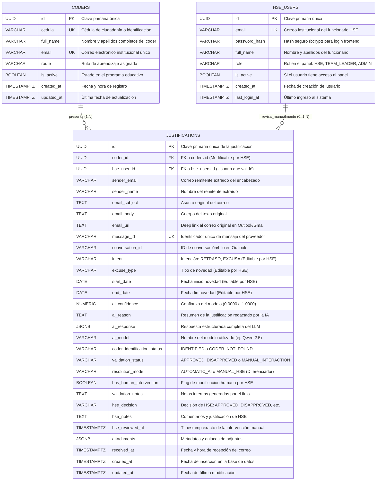
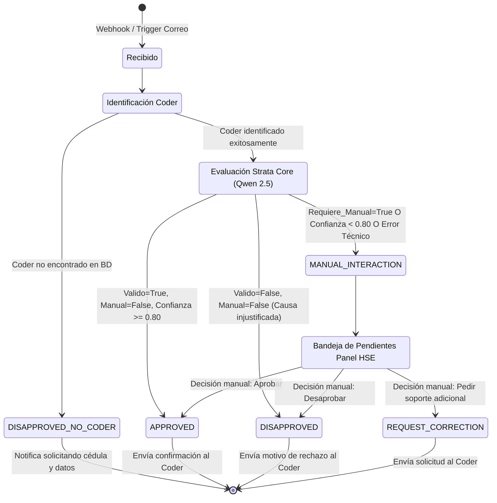
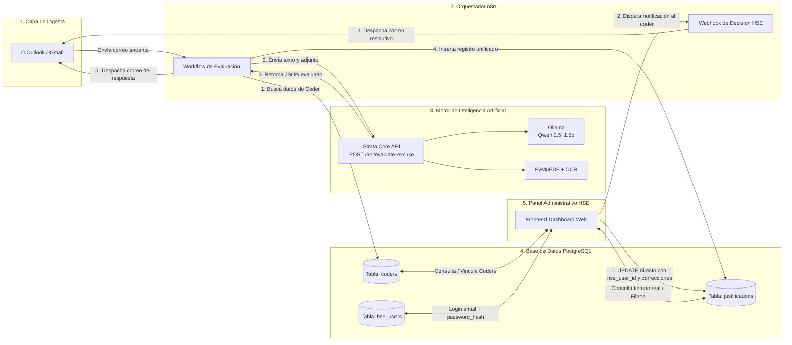

# Documentación Integral de la Base de Datos — Sistema de Justificaciones RIWI

**Proyecto:** Automatización de Justificaciones y Excusas de Coders — Área de Habilidades Socioemocionales (HSE)  
**Motor Relacional:** PostgreSQL 15+  
**Herramientas de Diseño Relacionadas:** `riwi_justifications_ER.drawio`  
**Fecha de Actualización:** 2026-09-27  

---

## 1. Contexto del Negocio y Objetivos del Sistema

En **RIWI**, los estudiantes (*coders*) que se encuentran en rutas de entrenamiento intensivo deben reportar sus inasistencias, llegadas tarde o salidas tempranas a través de correos institucionales o personales dirigidos al buzón oficial del área de **Habilidades Socioemocionales (HSE)**.

Históricamente, la recepción y gestión de estos correos era un proceso manual, propenso a retrasos en la respuesta, falta de trazabilidad y saturación del equipo humano. Para resolver esto, se diseñó una solución automatizada orquestada por **n8n**, potenciada por un motor de Inteligencia Artificial local denominado **Strata Core** (basado en el modelo LLM **Qwen 2.5: 1.5B** vía Ollama y procesamiento OCR con PyMuPDF), y respaldada por una base de datos relacional centralizada en **PostgreSQL**.

El propósito de la base de datos es:
1. Mantener el catálogo maestro de **Coders** activos e inactivos con sus rutas de formación.
2. Registrar a los usuarios administrativos del equipo de **HSE** con acceso al panel.
3. Almacenar el **historial unificado y auditable de justificaciones** recibidas por correo electrónico, preservando tanto la evidencia cruda del correo como los veredictos emitidos por el modelo de IA y las intervenciones humanas de HSE.

---

## 2. Evolución Arquitectónica: Razones de Diseño y Decisiones Clave

El esquema de base de datos actual es el resultado de un proceso iterativo de refinamiento técnico, donde se contrastaron propuestas iniciales frente a principios de escalabilidad, normalización y simplicidad operativa.

```
      [Esquema Heredado / Inicial]
      ├── hse_system_config  (Configuración y Prompts en BD)
      ├── email_templates    (Plantillas HTML en BD)
      └── justifications     (Tabla sobrecargada)
                 │
                 ▼  DEBATE: ¿Fragmentar en 3 tablas físicas?
                    (justifications_approved, justifications_disapproved, justifications_manual_hse)
                 │
                 ▼  DECISIÓN ARQUITECTÓNICA DEFINITIVA
      [Modelo Simplificado de 3 Entidades Maestras]
      ├── coders             (Entidad Maestra Coder)
      ├── hse_users          (Entidad Maestra HSE)
      └── justifications     (Tabla Transaccional Única con validation_status)
```

### 2.1. Eliminación de `hse_system_config` y `email_templates`

En versiones tempranas del proyecto (reflejadas aún en migraciones heredadas de la rama `feature/ai-engine`), existían tablas destinadas a almacenar configuraciones del sistema, parámetros de inferencia y plantillas de correo electrónico en formato HTML.

**Razones de su eliminación de PostgreSQL:**
1. **Separación de Responsabilidades (SoC):** La base de datos relacional debe contener **datos de negocio transaccionales e históricos**, no la lógica de ejecución del flujo.
2. **Ciclo de Vida de las Plantillas:** Las plantillas HTML de respuesta (aprobación, rechazo, solicitud de información) pertenecen a la capa de presentación/despacho, la cual vive y se versiona naturalmente dentro de los nodos de **n8n**. Almacenarlas en la BD obligaba a n8n a realizar consultas SQL adicionales por cada correo entrante solo para traer un fragmento de HTML.
3. **Parametrización del Modelo de IA:** El comportamiento del modelo (prompts del evaluador, guardrails deterministas, umbral de confianza) es gestionado directamente por el microservicio **Strata Core** mediante variables de entorno o archivos de configuración versionados en Git (`rules.json`), haciendo innecesaria una tabla de configuración en PostgreSQL.

---

### 2.2. Por qué una Sola Tabla `justifications` y NO Tres Tablas Separadas

Durante la etapa de diseño, se evaluó seriamente una propuesta para dividir los correos en tres tablas físicas independientes:
* `justifications_approved`
* `justifications_disapproved`
* `justifications_manual_hse`

Tras un exhaustivo análisis técnico, **esta idea fue descartada** en favor de una única tabla transaccional (`justifications`) gobernada por el campo `validation_status` (`APPROVED`, `DISAPPROVED`, `MANUAL_INTERACTION`).

#### Cuadro Comparativo de Justificación Técnica:

| Criterio | Enfoque de 3 Tablas Separadas | Enfoque de Tabla Única con `validation_status` (Adoptado) |
| :--- | :--- | :--- |
| **Integridad Transaccional** | Al cambiar el estado de un registro (p. ej. de revisión manual a aprobado por HSE), se requería un `DELETE` en la tabla origen y un `INSERT` en la tabla destino. Si la transacción fallaba a la mitad, se generaban registros huérfanos o duplicados. | Se realiza un simple `UPDATE justifications SET validation_status = 'APPROVED', ... WHERE id = $1;`. Operación atómica, rápida y sin riesgo de inconsistencias. |
| **Trazabilidad y Auditoría** | La fecha de creación original del registro (`created_at`) y sus llaves primarias se alteraban o perdían al migrar la fila entre tablas. | El registro conserva su `id` (UUID), su timestamp original de recepción y acumula los metadatos de auditoría en el mismo registro. |
| **Consultas del Frontend** | Para mostrar el panel general ordenado cronológicamente, el backend/frontend debía ejecutar consultas costosas con `UNION ALL` entre las tres tablas. | Una sola consulta directa y ultra veloz: `SELECT * FROM justifications ORDER BY created_at DESC LIMIT 50;`. |
| **Filtrado Dinámico** | Requería consultar tres endpoints o tablas distintas según la pestaña que el usuario seleccionara en el panel. | El frontend simplemente envía el filtro: `WHERE validation_status = 'APPROVED'` o consulta todo de una sola vez. |
| **Métricas y Estadísticas** | Complejo: cálculos de agregación (`COUNT`, porcentajes de aprobación, tiempos medios de resolución) dispersos en múltiples esquemas. | Inmediato y eficiente mediante índices parciales o simples `GROUP BY validation_status`. |
| **Evolución del Esquema** | Si se agregaba una nueva columna (ej. `attachments`), debía modificarse el DDL de 3 tablas idénticas en paralelo. | Se modifica un único esquema centralizado sin redundancia DDL. |

---

### 2.3. Decisiones sobre Tipos de Datos y Campos Específicos

1. **Uso de `UUID` como Clave Primaria:**
   * Evita la previsibilidad de los IDs autoincrementales (`SERIAL`).
   * Permite que n8n o sistemas externos generen el ID de la transacción de forma distribuida antes de insertarlo en la base de datos sin riesgo de colisiones.
2. **Campos `coder_id` y `hse_user_id` Nullable:**
   * `coder_id` es **NULL** cuando el correo entrante no coincide con ningún estudiante registrado en la plataforma (`coder_identification_status = 'CODER_NOT_FOUND'`). Esto permite almacenar el correo en la base de datos para no perder la evidencia y contactar al remitente solicitando su cédula.
   * `hse_user_id` es **NULL** de forma predeterminada mientras el caso es evaluado automáticamente por la IA. Solo se asocia un usuario de HSE cuando un integrante del equipo toma una decisión manual sobre el caso.
3. **Cálculo Dinámico de Días (`start_date` y `end_date`):**
   * En lugar de almacenar una columna estática `days` (días de inasistencia), se guardan las fechas exactas de inicio y fin (`DATE`). Los días totales se calculan dinámicamente (`end_date - start_date + 1`), garantizando consistencia si las fechas son corregidas. Si el correo no menciona fechas explícitas, la regla del negocio estipula que `start_date = end_date = fecha_del_correo`.
4. **Columnas de Tipo `JSONB` (`ai_response` y `attachments`):**
   * `ai_response`: Almacena la respuesta JSON cruda y completa generada por Strata Core (incluyendo sub-objetos como `detalles_adjunto`, `institucion_emisora`, `paginas_consultadas` y métricas de inferencia). Esto otorga flexibilidad futura si el LLM retorna nuevos metadatos sin necesidad de alterar columnas de la tabla.
   * `attachments`: Guarda un arreglo JSON con el nombre original, tipo MIME, tamaño y URL del archivo cargado en el bucket/almacenamiento local, permitiendo auditar múltiples adjuntos sin tablas intermedias innecesarias para la versión 1.0.
5. **Hipervínculo Directo al Correo (`email_url`):**
   * Permite que el personal de HSE, desde la interfaz web, haga clic en un botón y se abra de inmediato la conversación original en el cliente de correo corporativo (Outlook Web / Gmail) mediante el deep link correspondiente (`message_id` / `conversation_id`).

---

## 3. Diagramas Arquitectónicos y de Entidad-Relación

### 3.1. Diagrama Entidad-Relación (ERD)

A continuación se detalla la estructura relacional de las tres entidades principales, sus atributos, tipos de datos y relaciones de cardinalidad.



---

### 3.2. Ciclo de Vida de los Estados de una Justificación

El campo `validation_status` refleja la evolución del registro desde su entrada hasta su resolución final.



---

### 3.3. Interacción Integral del Sistema (Flujo de Datos y Componentes)



---

## 4. Diccionario de Datos Detallado

### 4.1. Tabla: `coders`
Almacena el catálogo de estudiantes matriculados en RIWI. Es la fuente de la verdad para validar la identidad de los remitentes.

| Nombre de Campo | Tipo de Dato | Nulo | Clave / Restricción | Descripción |
| :--- | :--- | :---: | :--- | :--- |
| `id` | `UUID` | NO | 🔑 **PK** (Default `gen_random_uuid()`) | Identificador único del coder en formato UUID v4. |
| `cedula` | `VARCHAR(30)` | NO | 🏷️ **UNIQUE** | Número de documento de identificación oficial. |
| `full_name` | `VARCHAR(150)` | NO | | Nombres y apellidos completos del coder. |
| `email` | `VARCHAR(255)` | NO | 🏷️ **UNIQUE** | Correo institucional o principal registrado en RIWI. |
| `route` | `VARCHAR(100)` | SÍ | | Ruta de desarrollo asignada (ej. `Node.js`, `Java`, `Python`). |
| `is_active` | `BOOLEAN` | NO | Default `TRUE` | `TRUE` si el coder está matriculado activamente. |
| `created_at` | `TIMESTAMPTZ`| NO | Default `CURRENT_TIMESTAMP` | Fecha y hora en que se registró el coder. |
| `updated_at` | `TIMESTAMPTZ`| NO | Default `CURRENT_TIMESTAMP` | Fecha de última modificación del registro. |

---

### 4.2. Tabla: `hse_users`
Representa al personal del equipo de Habilidades Socioemocionales y coordinadores con credenciales para acceder al panel web.

| Nombre de Campo | Tipo de Dato | Nulo | Clave / Restricción | Descripción |
| :--- | :--- | :---: | :--- | :--- |
| `id` | `UUID` | NO | 🔑 **PK** (Default `gen_random_uuid()`) | Identificador único del usuario administrativo. |
| `email` | `VARCHAR(255)` | NO | 🏷️ **UNIQUE** | Correo institucional corporativo de acceso. |
| `password_hash` | `VARCHAR(255)` | NO | | Hash seguro (bcrypt / argon2) para login directo en el frontend. |
| `full_name` | `VARCHAR(150)` | NO | | Nombre completo del profesional de HSE. |
| `role` | `VARCHAR(30)` | NO | Default `'HSE'` | Rol en la plataforma: `'HSE'`, `'TEAM_LEADER'`, `'ADMIN'`. |
| `is_active` | `BOOLEAN` | NO | Default `TRUE` | Estado de acceso del usuario al panel web. |
| `created_at` | `TIMESTAMPTZ`| NO | Default `CURRENT_TIMESTAMP` | Fecha de creación del usuario. |
| `last_login_at`| `TIMESTAMPTZ`| SÍ | | Última fecha y hora de inicio de sesión exitosa. |

---

### 4.3. Tabla: `justifications`
Es el núcleo transaccional del sistema. Guarda cada correo procesado, la evidencia documental, el análisis de la IA y el registro de intervención humana.

#### A. Relaciones y Llaves Foráneas
* `id` (`UUID`, PK): Identificador único del caso.
* `coder_id` (`UUID`, FK `coders.id` ON DELETE SET NULL): Referencia al coder identificado. Es `NULL` si no se pudo asociar a un coder existente en el sistema.
* `hse_user_id` (`UUID`, FK `hse_users.id` ON DELETE SET NULL): Referencia al usuario de HSE que ejecutó una acción manual. Es `NULL` si el caso fue resuelto 100% por la IA.

#### B. Metadatos del Mensaje y Auditoría del Correo
* `sender_email` (`VARCHAR(255)`, NOT NULL): Dirección de correo del remitente original.
* `sender_name` (`VARCHAR(150)`, NULL): Nombre mostrado en el cliente de correo.
* `email_subject` (`TEXT`, NOT NULL): Asunto original del correo.
* `email_body` (`TEXT`, NOT NULL): Cuerpo del mensaje recibido.
* `email_url` (`TEXT`, NULL): Enlace directo (deep link) para abrir el correo en Outlook/Gmail.
* `message_id` (`VARCHAR(255)`, UNIQUE, NOT NULL): ID inmutable del mensaje en el servidor de correo.
* `conversation_id` (`VARCHAR(255)`, NULL): ID del hilo de conversación para permitir respuestas encadenadas.
* `received_at` (`TIMESTAMPTZ`, NOT NULL): Fecha y hora en que el correo ingresó al buzón.

#### C. Temporalidad de la Novedad
* `start_date` (`DATE`, NOT NULL): Fecha de inicio de la inasistencia o novedad.
* `end_date` (`DATE`, NOT NULL): Fecha de finalización. Si no se especifican varios días, es igual a `start_date`.

#### D. Resultados de la Inteligencia Artificial (Strata Core / Qwen 2.5)
* `intent` (`VARCHAR(100)`, NULL): Intención general detectada (`RETRASO`, `EXCUSA`, `PERMISO`, `OTRO`).
* `excuse_type` (`VARCHAR(100)`, NOT NULL): Categoría específica (`inasistencia_medica`, `calamidad`, `tramite_oficial`, `falla_tecnica`, `tardanza`, `salida_temprana`, `no_identificado`).
* `ai_confidence` (`NUMERIC(5,4)`, NULL): Nivel de certidumbre del modelo (ej. `0.9500`).
* `ai_reason` (`TEXT`, NULL): Justificación y síntesis en lenguaje natural redactada por la IA para lectura humana rápida.
* `ai_response` (`JSONB`, NULL): Objeto JSON crudo entregado por la API de Strata Core.
* `ai_model` (`VARCHAR(100)`, DEFAULT `'qwen2.5:1.5b'`): Versión del modelo que ejecutó la inferencia.

#### E. Estados de Control, Diferenciador y Edición por HSE
* `coder_identification_status` (`VARCHAR(30)`, NOT NULL):
  * `'IDENTIFIED'`: El coder fue encontrado por correo, cédula o nombre.
  * `'CODER_NOT_FOUND'`: No hubo coincidencias; requiere datos de identificación (el usuario HSE puede asociar el coder manualmente desde el panel).
* `validation_status` (`VARCHAR(30)`, NOT NULL):
  * `'APPROVED'`: Excusa válida aprobada automáticamente o ratificada por HSE.
  * `'DISAPPROVED'`: Excusa no válida o rechazada por falta de soporte/identidad.
  * `'MANUAL_INTERACTION'`: Caso en espera de revisión humana en el panel de HSE.
* `resolution_mode` (`VARCHAR(20)`, NOT NULL, DEFAULT `'AUTOMATIC_AI'`):
  * `'AUTOMATIC_AI'`: Resuelto 100% de forma autónoma por el motor de IA.
  * `'MANUAL_HSE'`: Validado, modificado o dictaminado por un usuario humano de HSE.
* `has_human_intervention` (`BOOLEAN`, NOT NULL, DEFAULT `FALSE`):
  * Bandera booleana para filtrado directo en queries y estadísticas que identifica si el registro sufrió alteraciones o revisión manual por parte de HSE.
* `validation_notes` (`TEXT`, NULL): Notas de trazabilidad generadas durante la ejecución del workflow de n8n.
* **Capacidad de Corrección por HSE en Frontend:** El analista de HSE está facultado para modificar y corregir directamente en base de datos:
  1. `start_date` y `end_date` (fechas efectivas de la inasistencia).
  2. `excuse_type` e `intent` (reclasificar el tipo de novedad, ej. de simple tardanza a inasistencia médica).
  3. `coder_id` (vincular manualmente el coder al registro si la IA no logró asociarlo).

#### F. Auditoría de Decisión Humana (HSE)
* `hse_decision` (`VARCHAR(30)`, NULL): Acción tomada por HSE (`APPROVED`, `DISAPPROVED`, `REQUEST_CORRECTION`).
* `hse_notes` (`TEXT`, NULL): Observaciones o motivo de la decisión manual ingresada por el funcionario de HSE.
* `hse_reviewed_at` (`TIMESTAMPTZ`, NULL): Momento exacto en que se guardó la decisión en el panel.

#### G. Adjuntos y Trazabilidad de Base de Datos
* `attachments` (`JSONB`, NULL): Lista de archivos anexos con metadatos técnicos (nombre, mime type, hash/path).
* `created_at` (`TIMESTAMPTZ`, DEFAULT `CURRENT_TIMESTAMP`): Momento de inserción en BD.
* `updated_at` (`TIMESTAMPTZ`, DEFAULT `CURRENT_TIMESTAMP`): Momento de última actualización.

---

## 5. Script DDL Completo para PostgreSQL (`init_database.sql`)

A continuación se presenta el script SQL completo y ejecutable en PostgreSQL, con índices optimizados, restricciones de chequeo (`CHECK constraints`), comentarios descriptivos y triggers automáticos de auditoría:

```sql
-- =============================================================================
-- SISTEMA DE AUTOMATIZACIÓN DE JUSTIFICACIONES RIWI / HSE
-- Script DDL de Base de Datos PostgreSQL
-- Versión: 2.1 (Modelo con Auditoría Humana y Autenticación Directa HSE)
-- =============================================================================

CREATE EXTENSION IF NOT EXISTS "uuid-ossp";

-- Tablas en orden de dependencia
DROP VIEW IF EXISTS v_justifications_dashboard CASCADE;
DROP TABLE IF EXISTS justifications CASCADE;
DROP TABLE IF EXISTS hse_users CASCADE;
DROP TABLE IF EXISTS coders CASCADE;

-- =============================================================================
-- 1. TABLA coders
-- =============================================================================
CREATE TABLE coders (
    id UUID PRIMARY KEY DEFAULT uuid_generate_v4(),
    cedula VARCHAR(30) NOT NULL UNIQUE,
    full_name VARCHAR(150) NOT NULL,
    email VARCHAR(255) NOT NULL UNIQUE,
    route VARCHAR(100),
    is_active BOOLEAN NOT NULL DEFAULT TRUE,
    created_at TIMESTAMPTZ NOT NULL DEFAULT CURRENT_TIMESTAMP,
    updated_at TIMESTAMPTZ NOT NULL DEFAULT CURRENT_TIMESTAMP
);

COMMENT ON TABLE coders IS 'Catálogo maestro de estudiantes (coders) activos e inactivos en RIWI';
COMMENT ON COLUMN coders.cedula IS 'Documento nacional de identificación del coder (único)';
COMMENT ON COLUMN coders.email IS 'Correo electrónico institucional o principal registrado';
COMMENT ON COLUMN coders.route IS 'Ruta de formación técnica en la que está asignado';

-- =============================================================================
-- 2. TABLA hse_users (Con autenticación por contraseña en Frontend)
-- =============================================================================
CREATE TABLE hse_users (
    id UUID PRIMARY KEY DEFAULT uuid_generate_v4(),
    email VARCHAR(255) NOT NULL UNIQUE,
    password_hash VARCHAR(255) NOT NULL,
    full_name VARCHAR(150) NOT NULL,
    role VARCHAR(30) NOT NULL DEFAULT 'HSE',
    is_active BOOLEAN NOT NULL DEFAULT TRUE,
    created_at TIMESTAMPTZ NOT NULL DEFAULT CURRENT_TIMESTAMP,
    last_login_at TIMESTAMPTZ,
    CONSTRAINT chk_hse_role CHECK (role IN ('HSE', 'TEAM_LEADER', 'ADMIN'))
);

COMMENT ON TABLE hse_users IS 'Usuarios administrativos de HSE y coordinadores con acceso al panel web';
COMMENT ON COLUMN hse_users.password_hash IS 'Hash seguro de contraseña (bcrypt / argon2) para login directo en frontend';
COMMENT ON COLUMN hse_users.role IS 'Rol administrativo con permisos en el dashboard web';

-- =============================================================================
-- 3. TABLA justifications (Con diferenciador de intervención humana)
-- =============================================================================
CREATE TABLE justifications (
    id UUID PRIMARY KEY DEFAULT uuid_generate_v4(),
    
    -- Relaciones
    coder_id UUID REFERENCES coders(id) ON DELETE SET NULL,
    hse_user_id UUID REFERENCES hse_users(id) ON DELETE SET NULL,
    
    -- Datos del correo entrante
    sender_email VARCHAR(255) NOT NULL,
    sender_name VARCHAR(150),
    email_subject TEXT NOT NULL,
    email_body TEXT NOT NULL,
    email_url TEXT,
    message_id VARCHAR(255) NOT NULL UNIQUE,
    conversation_id VARCHAR(255),
    received_at TIMESTAMPTZ NOT NULL DEFAULT CURRENT_TIMESTAMP,
    
    -- Clasificación e Intención (Corregible por HSE)
    intent VARCHAR(100) DEFAULT 'EXCUSA',
    excuse_type VARCHAR(100) NOT NULL DEFAULT 'no_identificado',
    start_date DATE NOT NULL,
    end_date DATE NOT NULL,
    
    -- Inteligencia Artificial (Strata Core / Qwen 2.5)
    ai_confidence NUMERIC(5,4),
    ai_reason TEXT,
    ai_response JSONB,
    ai_model VARCHAR(100) DEFAULT 'qwen2.5:1.5b',
    
    -- Estados del Ciclo de Vida y Diferenciador de Resolución
    coder_identification_status VARCHAR(30) NOT NULL DEFAULT 'IDENTIFIED',
    validation_status VARCHAR(30) NOT NULL DEFAULT 'MANUAL_INTERACTION',
    validation_notes TEXT,
    
    -- FACTOR DIFERENCIADOR DE INTERVENCIÓN HUMANA
    resolution_mode VARCHAR(20) NOT NULL DEFAULT 'AUTOMATIC_AI',
    has_human_intervention BOOLEAN NOT NULL DEFAULT FALSE,
    
    -- Auditoría de Gestión Humana (HSE)
    hse_decision VARCHAR(30),
    hse_notes TEXT,
    hse_reviewed_at TIMESTAMPTZ,
    
    -- Adjuntos y Auditoría
    attachments JSONB,
    created_at TIMESTAMPTZ NOT NULL DEFAULT CURRENT_TIMESTAMP,
    updated_at TIMESTAMPTZ NOT NULL DEFAULT CURRENT_TIMESTAMP,
    
    -- Restricciones de Dominio
    CONSTRAINT chk_coder_ident_status CHECK (
        coder_identification_status IN ('IDENTIFIED', 'CODER_NOT_FOUND')
    ),
    CONSTRAINT chk_validation_status CHECK (
        validation_status IN ('APPROVED', 'DISAPPROVED', 'MANUAL_INTERACTION')
    ),
    CONSTRAINT chk_resolution_mode CHECK (
        resolution_mode IN ('AUTOMATIC_AI', 'MANUAL_HSE')
    ),
    CONSTRAINT chk_hse_decision CHECK (
        hse_decision IS NULL OR hse_decision IN ('APPROVED', 'DISAPPROVED', 'REQUEST_CORRECTION')
    ),
    CONSTRAINT chk_dates_validity CHECK (end_date >= start_date)
);

COMMENT ON TABLE justifications IS 'Historial centralizado de correos y justificaciones de inasistencia';
COMMENT ON COLUMN justifications.coder_id IS 'FK al coder. Modificable/vinculable manualmente por HSE';
COMMENT ON COLUMN justifications.validation_status IS 'Estado del registro: APPROVED, DISAPPROVED o MANUAL_INTERACTION';
COMMENT ON COLUMN justifications.resolution_mode IS 'Diferenciador de origen de resolución: AUTOMATIC_AI o MANUAL_HSE';
COMMENT ON COLUMN justifications.has_human_intervention IS 'Indica si un usuario de HSE realizó modificaciones o validaciones';
COMMENT ON COLUMN justifications.email_url IS 'Enlace directo para visualización del correo en el cliente web';
COMMENT ON COLUMN justifications.ai_response IS 'JSON completo devuelto por Strata Core para auditoría avanzada';

-- =============================================================================
-- ÍNDICES DE RENDIMIENTO (Performance Tuning)
-- =============================================================================
CREATE INDEX idx_coders_email ON coders(email);
CREATE INDEX idx_coders_cedula ON coders(cedula);
CREATE INDEX idx_coders_active ON coders(is_active);

CREATE INDEX idx_justifications_status_created ON justifications(validation_status, created_at DESC);
CREATE INDEX idx_justifications_resolution_mode ON justifications(resolution_mode);
CREATE INDEX idx_justifications_human_interv ON justifications(has_human_intervention);
CREATE INDEX idx_justifications_coder_id ON justifications(coder_id);
CREATE INDEX idx_justifications_hse_user_id ON justifications(hse_user_id);
CREATE INDEX idx_justifications_sender_email ON justifications(sender_email);
CREATE INDEX idx_justifications_received_at ON justifications(received_at DESC);
CREATE INDEX idx_justifications_message_id ON justifications(message_id);

CREATE INDEX idx_justifications_ai_response ON justifications USING GIN (ai_response);
CREATE INDEX idx_justifications_attachments ON justifications USING GIN (attachments);

-- =============================================================================
-- TRIGGERS PARA AUDITORÍA AUTOMÁTICA (updated_at)
-- =============================================================================
CREATE OR REPLACE FUNCTION update_updated_at_column()
RETURNS TRIGGER AS $$
BEGIN
    NEW.updated_at = CURRENT_TIMESTAMP;
    RETURN NEW;
END;
$$ LANGUAGE plpgsql;

CREATE TRIGGER trg_coders_updated_at
BEFORE UPDATE ON coders
FOR EACH ROW
EXECUTE FUNCTION update_updated_at_column();

CREATE TRIGGER trg_justifications_updated_at
BEFORE UPDATE ON justifications
FOR EACH ROW
EXECUTE FUNCTION update_updated_at_column();

-- =============================================================================
-- VISTA DE CONSULTA OPTIMIZADA PARA EL DASHBOARD HSE
-- =============================================================================
CREATE OR REPLACE VIEW v_justifications_dashboard AS
SELECT 
    j.id,
    j.validation_status,
    j.resolution_mode,
    j.has_human_intervention,
    j.coder_identification_status,
    j.coder_id,
    COALESCE(c.full_name, j.sender_name, 'Coder no identificado') AS coder_display_name,
    COALESCE(c.cedula, 'Sin cédula') AS coder_cedula,
    c.route AS coder_route,
    j.sender_email,
    j.email_subject,
    j.email_url,
    j.intent,
    j.excuse_type,
    j.start_date,
    j.end_date,
    (j.end_date - j.start_date + 1) AS total_days,
    j.ai_confidence,
    j.ai_reason,
    j.received_at,
    j.created_at,
    j.hse_decision,
    j.hse_notes,
    j.hse_user_id,
    u.full_name AS hse_reviewer_name,
    u.email AS hse_reviewer_email,
    j.hse_reviewed_at,
    CASE 
        WHEN j.attachments IS NOT NULL AND jsonb_array_length(j.attachments) > 0 THEN TRUE 
        ELSE FALSE 
    END AS has_attachments
FROM justifications j
LEFT JOIN coders c ON j.coder_id = c.id
LEFT JOIN hse_users u ON j.hse_user_id = u.id;

COMMENT ON VIEW v_justifications_dashboard IS 'Vista enriquecida con trazabilidad completa de intervención humana para el Dashboard HSE';

```

---

## 6. Integración con el Flujo de Datos y el Frontend

### 6.1. ¿Cómo consume n8n este esquema?
1. **Paso de Identificación (`Find Coder`):**
   ```sql
   SELECT id, full_name, email, route 
   FROM coders 
   WHERE email = $1 OR cedula = $2 OR LOWER(full_name) = LOWER($3)
   LIMIT 1;
   ```
2. **Paso de Persistencia de Justificación Evaluada:**
   Inserta directamente en `justifications` con el resultado de la inferencia, asignando `validation_status` a `APPROVED`, `DISAPPROVED` o `MANUAL_INTERACTION`.
3. **Paso de Intervención Manual (Webhook HSE):**
   ```sql
   UPDATE justifications 
   SET 
       validation_status = $1, -- 'APPROVED' o 'DISAPPROVED'
       hse_decision = $1,
       hse_notes = $2,
       hse_user_id = $3,
       hse_reviewed_at = CURRENT_TIMESTAMP
   WHERE id = $4;
   ```

### 6.2. ¿Cómo consume el Frontend este esquema?
El Frontend no necesita realizar uniones complejas; consulta la vista `v_justifications_dashboard`:
* **Pestaña "Válidas":** `SELECT * FROM v_justifications_dashboard WHERE validation_status = 'APPROVED' ORDER BY created_at DESC;`
* **Pestaña "No Válidas":** `SELECT * FROM v_justifications_dashboard WHERE validation_status = 'DISAPPROVED' ORDER BY created_at DESC;`
* **Pestaña "Intervención Manual":** `SELECT * FROM v_justifications_dashboard WHERE validation_status = 'MANUAL_INTERACTION' ORDER BY created_at ASC;`

Con esta arquitectura, la base de datos se mantiene concisa, altamente performante, auditable y perfectamente acoplada al ciclo operativo de RIWI.
