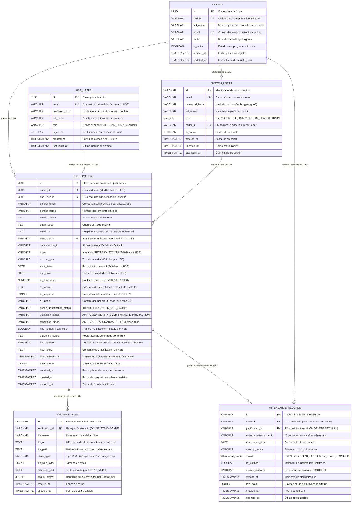
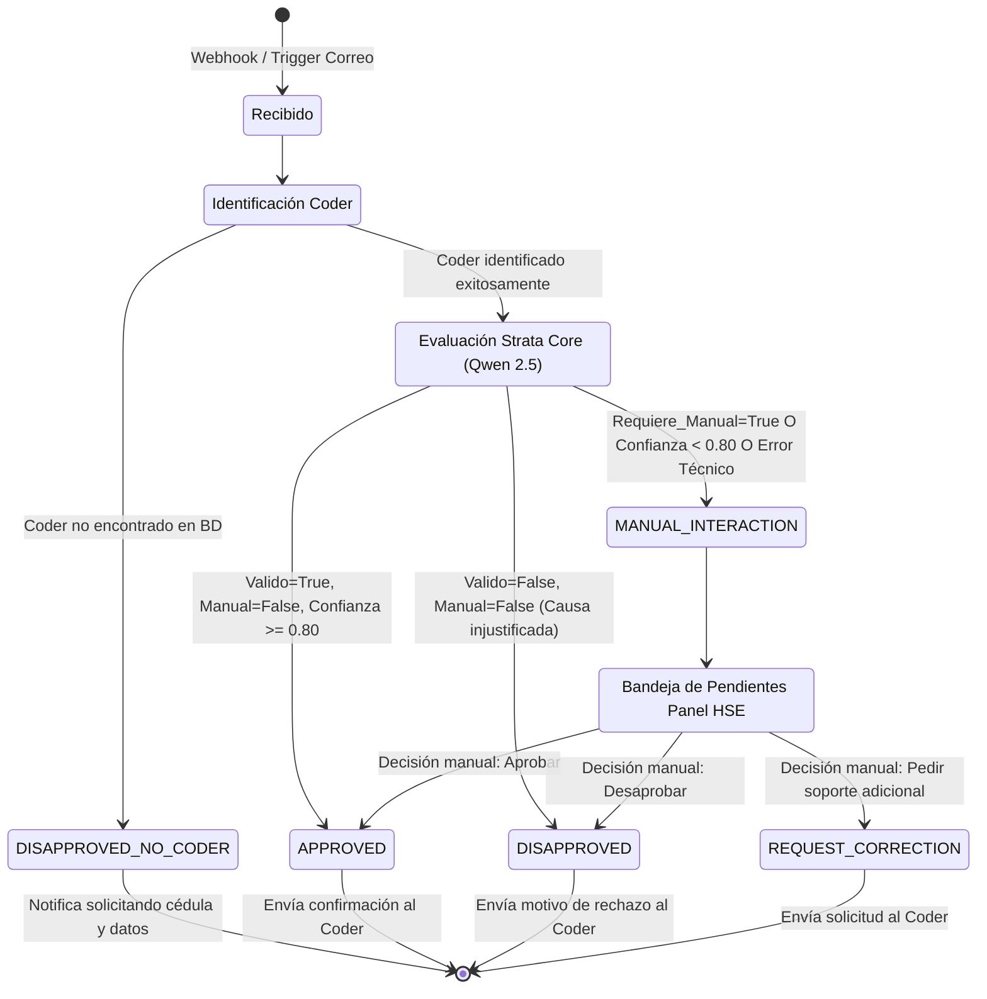
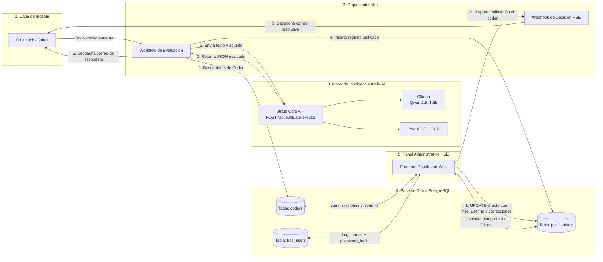

# Documentación Integral de la Base de Datos — Sistema de Justificaciones RIWI

**Proyecto:** Automatización de Justificaciones y Excusas de Coders — Área de Habilidades Socioemocionales (HSE)  
**Motor Relacional:** PostgreSQL 15+  
**Herramientas de Diseño Relacionadas:** `riwi_justifications_ER.drawio`  
**Fecha de Actualización:** 2026-09-29  
**Versión:** 2.2 — Implementación de RBAC, Roles y Políticas RLS en PostgreSQL (User Story [DB-01])  

---

## 1. Contexto del Negocio y Objetivos del Sistema

En **RIWI**, los estudiantes (*coders*) que se encuentran en rutas de entrenamiento intensivo deben reportar sus inasistencias, llegadas tarde o salidas tempranas a través de correos institucionales o personales dirigidos al buzón oficial del área de **Habilidades Socioemocionales (HSE)**.

Históricamente, la recepción y gestión de estos correos era un proceso manual, propenso a retrasos en la respuesta, falta de trazabilidad y saturación del equipo humano. Para resolver esto, se diseñó una solución automatizada orquestada por **n8n**, potenciada por un motor de Inteligencia Artificial local denominado **Strata Core** (basado en el modelo LLM **Qwen 2.5: 1.5B** vía Ollama y procesamiento OCR con PyMuPDF), y respaldada por una base de datos relacional centralizada en **PostgreSQL**.

El propósito de la base de datos es:
1. Mantener el catálogo maestro de **Coders** activos e inactivos con sus rutas de formación.
2. Registrar a los usuarios administrativos del equipo de **HSE** con acceso al panel.
3. Almacenar el **historial unificado y auditable de justificaciones** recibidas por correo electrónico, preservando tanto la evidencia cruda del correo como los veredictos emitidos por el modelo de IA y las intervenciones humanas de HSE.

---

## 2. Evolución Arquitectónica: Razones de Diseño y Decisiones Clave

El esquema de base de datos actual es el resultado de un proceso iterativo de refinamiento técnico, donde se contrastaron propuestas iniciales frente a principios de escalabilidad, normalización y simplicidad operativa.

```
      [Esquema Heredado / Inicial]
      ├── hse_system_config  (Configuración y Prompts en BD)
      ├── email_templates    (Plantillas HTML en BD)
      └── justifications     (Tabla sobrecargada)
                 │
                 ▼  DEBATE: ¿Fragmentar en 3 tablas físicas?
                    (justifications_approved, justifications_disapproved, justifications_manual_hse)
                 │
                 ▼  DECISIÓN ARQUITECTÓNICA DEFINITIVA
      [Modelo Simplificado de 3 Entidades Maestras]
      ├── coders             (Entidad Maestra Coder)
      ├── hse_users          (Entidad Maestra HSE)
      └── justifications     (Tabla Transaccional Única con validation_status)
```

### 2.1. Eliminación de `hse_system_config` y `email_templates`

En versiones tempranas del proyecto (reflejadas aún en migraciones heredadas de la rama `feature/ai-engine`), existían tablas destinadas a almacenar configuraciones del sistema, parámetros de inferencia y plantillas de correo electrónico en formato HTML.

**Razones de su eliminación de PostgreSQL:**
1. **Separación de Responsabilidades (SoC):** La base de datos relacional debe contener **datos de negocio transaccionales e históricos**, no la lógica de ejecución del flujo.
2. **Ciclo de Vida de las Plantillas:** Las plantillas HTML de respuesta (aprobación, rechazo, solicitud de información) pertenecen a la capa de presentación/despacho, la cual vive y se versiona naturalmente dentro de los nodos de **n8n**. Almacenarlas en la BD obligaba a n8n a realizar consultas SQL adicionales por cada correo entrante solo para traer un fragmento de HTML.
3. **Parametrización del Modelo de IA:** El comportamiento del modelo (prompts del evaluador, guardrails deterministas, umbral de confianza) es gestionado directamente por el microservicio **Strata Core** mediante variables de entorno o archivos de configuración versionados en Git (`rules.json`), haciendo innecesaria una tabla de configuración en PostgreSQL.

---

### 2.2. Por qué una Sola Tabla `justifications` y NO Tres Tablas Separadas

Durante la etapa de diseño, se evaluó seriamente una propuesta para dividir los correos en tres tablas físicas independientes:
* `justifications_approved`
* `justifications_disapproved`
* `justifications_manual_hse`

Tras un exhaustivo análisis técnico, **esta idea fue descartada** en favor de una única tabla transaccional (`justifications`) gobernada por el campo `validation_status` (`APPROVED`, `DISAPPROVED`, `MANUAL_INTERACTION`).

#### Cuadro Comparativo de Justificación Técnica:

| Criterio | Enfoque de 3 Tablas Separadas | Enfoque de Tabla Única con `validation_status` (Adoptado) |
| :--- | :--- | :--- |
| **Integridad Transaccional** | Al cambiar el estado de un registro (p. ej. de revisión manual a aprobado por HSE), se requería un `DELETE` en la tabla origen y un `INSERT` en la tabla destino. Si la transacción fallaba a la mitad, se generaban registros huérfanos o duplicados. | Se realiza un simple `UPDATE justifications SET validation_status = 'APPROVED', ... WHERE id = $1;`. Operación atómica, rápida y sin riesgo de inconsistencias. |
| **Trazabilidad y Auditoría** | La fecha de creación original del registro (`created_at`) y sus llaves primarias se alteraban o perdían al migrar la fila entre tablas. | El registro conserva su `id` (UUID), su timestamp original de recepción y acumula los metadatos de auditoría en el mismo registro. |
| **Consultas del Frontend** | Para mostrar el panel general ordenado cronológicamente, el backend/frontend debía ejecutar consultas costosas con `UNION ALL` entre las tres tablas. | Una sola consulta directa y ultra veloz: `SELECT * FROM justifications ORDER BY created_at DESC LIMIT 50;`. |
| **Filtrado Dinámico** | Requería consultar tres endpoints o tablas distintas según la pestaña que el usuario seleccionara en el panel. | El frontend simplemente envía el filtro: `WHERE validation_status = 'APPROVED'` o consulta todo de una sola vez. |
| **Métricas y Estadísticas** | Complejo: cálculos de agregación (`COUNT`, porcentajes de aprobación, tiempos medios de resolución) dispersos en múltiples esquemas. | Inmediato y eficiente mediante índices parciales o simples `GROUP BY validation_status`. |
| **Evolución del Esquema** | Si se agregaba una nueva columna (ej. `attachments`), debía modificarse el DDL de 3 tablas idénticas en paralelo. | Se modifica un único esquema centralizado sin redundancia DDL. |

---

### 2.3. Decisiones sobre Tipos de Datos y Campos Específicos

1. **Uso de `UUID` como Clave Primaria:**
   * Evita la previsibilidad de los IDs autoincrementales (`SERIAL`).
   * Permite que n8n o sistemas externos generen el ID de la transacción de forma distribuida antes de insertarlo en la base de datos sin riesgo de colisiones.
2. **Campos `coder_id` y `hse_user_id` Nullable:**
   * `coder_id` es **NULL** cuando el correo entrante no coincide con ningún estudiante registrado en la plataforma (`coder_identification_status = 'CODER_NOT_FOUND'`). Esto permite almacenar el correo en la base de datos para no perder la evidencia y contactar al remitente solicitando su cédula.
   * `hse_user_id` es **NULL** de forma predeterminada mientras el caso es evaluado automáticamente por la IA. Solo se asocia un usuario de HSE cuando un integrante del equipo toma una decisión manual sobre el caso.
3. **Cálculo Dinámico de Días (`start_date` y `end_date`):**
   * En lugar de almacenar una columna estática `days` (días de inasistencia), se guardan las fechas exactas de inicio y fin (`DATE`). Los días totales se calculan dinámicamente (`end_date - start_date + 1`), garantizando consistencia si las fechas son corregidas. Si el correo no menciona fechas explícitas, la regla del negocio estipula que `start_date = end_date = fecha_del_correo`.
4. **Columnas de Tipo `JSONB` (`ai_response` y `attachments`):**
   * `ai_response`: Almacena la respuesta JSON cruda y completa generada por Strata Core (incluyendo sub-objetos como `detalles_adjunto`, `institucion_emisora`, `paginas_consultadas` y métricas de inferencia). Esto otorga flexibilidad futura si el LLM retorna nuevos metadatos sin necesidad de alterar columnas de la tabla.
   * `attachments`: Guarda un arreglo JSON con el nombre original, tipo MIME, tamaño y URL del archivo cargado en el bucket/almacenamiento local, permitiendo auditar múltiples adjuntos sin tablas intermedias innecesarias para la versión 1.0.
5. **Hipervínculo Directo al Correo (`email_url`):**
   * Permite que el personal de HSE, desde la interfaz web, haga clic en un botón y se abra de inmediato la conversación original en el cliente de correo corporativo (Outlook Web / Gmail) mediante el deep link correspondiente (`message_id` / `conversation_id`).

---

## 3. Diagramas Arquitectónicos y de Entidad-Relación

### 3.1. Diagrama Entidad-Relación (ERD)

A continuación se detalla la estructura relacional de las tres entidades principales, sus atributos, tipos de datos y relaciones de cardinalidad.



---

### 3.2. Ciclo de Vida de los Estados de una Justificación

El campo `validation_status` refleja la evolución del registro desde su entrada hasta su resolución final.



---

### 3.3. Interacción Integral del Sistema (Flujo de Datos y Componentes)



---

## 4. Diccionario de Datos Detallado

### 4.1. Tabla: `coders`
Almacena el catálogo de estudiantes matriculados en RIWI. Es la fuente de la verdad para validar la identidad de los remitentes.

| Nombre de Campo | Tipo de Dato | Nulo | Clave / Restricción | Descripción |
| :--- | :--- | :---: | :--- | :--- |
| `id` | `UUID` | NO | 🔑 **PK** (Default `gen_random_uuid()`) | Identificador único del coder en formato UUID v4. |
| `cedula` | `VARCHAR(30)` | NO | 🏷️ **UNIQUE** | Número de documento de identificación oficial. |
| `full_name` | `VARCHAR(150)` | NO | | Nombres y apellidos completos del coder. |
| `email` | `VARCHAR(255)` | NO | 🏷️ **UNIQUE** | Correo institucional o principal registrado en RIWI. |
| `route` | `VARCHAR(100)` | SÍ | | Ruta de desarrollo asignada (ej. `Node.js`, `Java`, `Python`). |
| `is_active` | `BOOLEAN` | NO | Default `TRUE` | `TRUE` si el coder está matriculado activamente. |
| `created_at` | `TIMESTAMPTZ`| NO | Default `CURRENT_TIMESTAMP` | Fecha y hora en que se registró el coder. |
| `updated_at` | `TIMESTAMPTZ`| NO | Default `CURRENT_TIMESTAMP` | Fecha de última modificación del registro. |

---

### 4.2. Tabla: `hse_users`
Representa al personal del equipo de Habilidades Socioemocionales y coordinadores con credenciales para acceder al panel web.

| Nombre de Campo | Tipo de Dato | Nulo | Clave / Restricción | Descripción |
| :--- | :--- | :---: | :--- | :--- |
| `id` | `UUID` | NO | 🔑 **PK** (Default `gen_random_uuid()`) | Identificador único del usuario administrativo. |
| `email` | `VARCHAR(255)` | NO | 🏷️ **UNIQUE** | Correo institucional corporativo de acceso. |
| `password_hash` | `VARCHAR(255)` | NO | | Hash seguro (bcrypt / argon2) para login directo en el frontend. |
| `full_name` | `VARCHAR(150)` | NO | | Nombre completo del profesional de HSE. |
| `role` | `VARCHAR(30)` | NO | Default `'HSE'` | Rol en la plataforma: `'HSE'`, `'TEAM_LEADER'`, `'ADMIN'`. |
| `is_active` | `BOOLEAN` | NO | Default `TRUE` | Estado de acceso del usuario al panel web. |
| `created_at` | `TIMESTAMPTZ`| NO | Default `CURRENT_TIMESTAMP` | Fecha de creación del usuario. |
| `last_login_at`| `TIMESTAMPTZ`| SÍ | | Última fecha y hora de inicio de sesión exitosa. |

---

### 4.3. Tabla: `justifications`
Es el núcleo transaccional del sistema. Guarda cada correo procesado, la evidencia documental, el análisis de la IA y el registro de intervención humana.

#### A. Relaciones y Llaves Foráneas
* `id` (`UUID`, PK): Identificador único del caso.
* `coder_id` (`UUID`, FK `coders.id` ON DELETE SET NULL): Referencia al coder identificado. Es `NULL` si no se pudo asociar a un coder existente en el sistema.
* `hse_user_id` (`UUID`, FK `hse_users.id` ON DELETE SET NULL): Referencia al usuario de HSE que ejecutó una acción manual. Es `NULL` si el caso fue resuelto 100% por la IA.

#### B. Metadatos del Mensaje y Auditoría del Correo
* `sender_email` (`VARCHAR(255)`, NOT NULL): Dirección de correo del remitente original.
* `sender_name` (`VARCHAR(150)`, NULL): Nombre mostrado en el cliente de correo.
* `email_subject` (`TEXT`, NOT NULL): Asunto original del correo.
* `email_body` (`TEXT`, NOT NULL): Cuerpo del mensaje recibido.
* `email_url` (`TEXT`, NULL): Enlace directo (deep link) para abrir el correo en Outlook/Gmail.
* `message_id` (`VARCHAR(255)`, UNIQUE, NOT NULL): ID inmutable del mensaje en el servidor de correo.
* `conversation_id` (`VARCHAR(255)`, NULL): ID del hilo de conversación para permitir respuestas encadenadas.
* `received_at` (`TIMESTAMPTZ`, NOT NULL): Fecha y hora en que el correo ingresó al buzón.

#### C. Temporalidad de la Novedad
* `start_date` (`DATE`, NOT NULL): Fecha de inicio de la inasistencia o novedad.
* `end_date` (`DATE`, NOT NULL): Fecha de finalización. Si no se especifican varios días, es igual a `start_date`.

#### D. Resultados de la Inteligencia Artificial (Strata Core / Qwen 2.5)
* `intent` (`VARCHAR(100)`, NULL): Intención general detectada (`RETRASO`, `EXCUSA`, `PERMISO`, `OTRO`).
* `excuse_type` (`VARCHAR(100)`, NOT NULL): Categoría específica (`inasistencia_medica`, `calamidad`, `tramite_oficial`, `falla_tecnica`, `tardanza`, `salida_temprana`, `no_identificado`).
* `ai_confidence` (`NUMERIC(5,4)`, NULL): Nivel de certidumbre del modelo (ej. `0.9500`).
* `ai_reason` (`TEXT`, NULL): Justificación y síntesis en lenguaje natural redactada por la IA para lectura humana rápida.
* `ai_response` (`JSONB`, NULL): Objeto JSON crudo entregado por la API de Strata Core.
* `ai_model` (`VARCHAR(100)`, DEFAULT `'qwen2.5:1.5b'`): Versión del modelo que ejecutó la inferencia.

#### E. Estados de Control, Diferenciador y Edición por HSE
* `coder_identification_status` (`VARCHAR(30)`, NOT NULL):
  * `'IDENTIFIED'`: El coder fue encontrado por correo, cédula o nombre.
  * `'CODER_NOT_FOUND'`: No hubo coincidencias; requiere datos de identificación (el usuario HSE puede asociar el coder manualmente desde el panel).
* `validation_status` (`VARCHAR(30)`, NOT NULL):
  * `'APPROVED'`: Excusa válida aprobada automáticamente o ratificada por HSE.
  * `'DISAPPROVED'`: Excusa no válida o rechazada por falta de soporte/identidad.
  * `'MANUAL_INTERACTION'`: Caso en espera de revisión humana en el panel de HSE.
* `resolution_mode` (`VARCHAR(20)`, NOT NULL, DEFAULT `'AUTOMATIC_AI'`):
  * `'AUTOMATIC_AI'`: Resuelto 100% de forma autónoma por el motor de IA.
  * `'MANUAL_HSE'`: Validado, modificado o dictaminado por un usuario humano de HSE.
* `has_human_intervention` (`BOOLEAN`, NOT NULL, DEFAULT `FALSE`):
  * Bandera booleana para filtrado directo en queries y estadísticas que identifica si el registro sufrió alteraciones o revisión manual por parte de HSE.
* `validation_notes` (`TEXT`, NULL): Notas de trazabilidad generadas durante la ejecución del workflow de n8n.
* **Capacidad de Corrección por HSE en Frontend:** El analista de HSE está facultado para modificar y corregir directamente en base de datos:
  1. `start_date` y `end_date` (fechas efectivas de la inasistencia).
  2. `excuse_type` e `intent` (reclasificar el tipo de novedad, ej. de simple tardanza a inasistencia médica).
  3. `coder_id` (vincular manualmente el coder al registro si la IA no logró asociarlo).

#### F. Auditoría de Decisión Humana (HSE)
* `hse_decision` (`VARCHAR(30)`, NULL): Acción tomada por HSE (`APPROVED`, `DISAPPROVED`, `REQUEST_CORRECTION`).
* `hse_notes` (`TEXT`, NULL): Observaciones o motivo de la decisión manual ingresada por el funcionario de HSE.
* `hse_reviewed_at` (`TIMESTAMPTZ`, NULL): Momento exacto en que se guardó la decisión en el panel.

#### G. Adjuntos y Trazabilidad de Base de Datos
* `attachments` (`JSONB`, NULL): Lista de archivos anexos con metadatos técnicos (nombre, mime type, hash/path).
* `created_at` (`TIMESTAMPTZ`, DEFAULT `CURRENT_TIMESTAMP`): Momento de inserción en BD.
* `updated_at` (`TIMESTAMPTZ`, DEFAULT `CURRENT_TIMESTAMP`): Momento de última actualización.

---


---

### 4.4. Tabla: `system_users` (Núcleo RBAC)
Entidad unificada de autenticación y control de acceso basado en roles (RBAC). Permite centralizar tanto a los estudiantes (Coders) como a los roles administrativos (HSE_ANALYST, TEAM_LEADER, ADMIN).

| Nombre de Campo | Tipo de Dato | Nulo | Clave / Restricción | Descripción |
| :--- | :--- | :---: | :--- | :--- |
| `id` | `VARCHAR(100)` | NO | 🔑 **PK** (Default `gen_random_uuid()::text`) | Identificador único del usuario. |
| `email` | `VARCHAR(255)` | NO | 🏷️ **UNIQUE** | Correo electrónico de inicio de sesión. |
| `password_hash` | `VARCHAR(255)` | SÍ | | Hash de contraseña para acceso interactivo. |
| `full_name` | `VARCHAR(150)` | NO | | Nombre completo y apellidos. |
| `role` | `user_role` (ENUM) | NO | Default `'CODER'` | Rol en el sistema: `'CODER'`, `'HSE_ANALYST'`, `'TEAM_LEADER'`, `'ADMIN'`. |
| `coder_id` | `VARCHAR(100)` | SÍ | 🔗 **FK** (`coders.id`) | Vinculación al registro maestro de coder si aplica. |
| `is_active` | `BOOLEAN` | NO | Default `TRUE` | Bandera de activación de cuenta. |
| `created_at` | `TIMESTAMPTZ`| NO | Default `CURRENT_TIMESTAMP` | Fecha de creación del registro. |
| `updated_at` | `TIMESTAMPTZ`| NO | Default `CURRENT_TIMESTAMP` | Fecha de última actualización. |
| `last_login_at`| `TIMESTAMPTZ`| SÍ | | Fecha y hora del último login registrado. |

---

### 4.5. Tabla: `evidence_files` (Evidencias y Bounding Boxes Espaciales)
Almacena los soportes adjuntos (PDFs, imágenes de incapacidades médicas, certificados) vinculados a cada justificación, incluyendo las coordenadas espaciales generadas por el motor **Strata Core** para el visor web.

| Nombre de Campo | Tipo de Dato | Nulo | Clave / Restricción | Descripción |
| :--- | :--- | :---: | :--- | :--- |
| `id` | `VARCHAR(100)` | NO | 🔑 **PK** (Default `gen_random_uuid()::text`) | Clave única de la evidencia documental. |
| `justification_id` | `VARCHAR(100)` | NO | 🔗 **FK** (`justifications.id` ON DELETE CASCADE) | Solicitud de justificación a la que pertenece el soporte. |
| `file_name` | `VARCHAR(255)` | NO | | Nombre original del archivo adjunto. |
| `file_url` | `TEXT` | NO | | Enlace o endpoint de descarga del documento. |
| `file_path` | `TEXT` | SÍ | | Ruta física en el bucket de almacenamiento. |
| `mime_type` | `VARCHAR(100)` | SÍ | | Tipo MIME (`application/pdf`, `image/jpeg`, etc.). |
| `file_size_bytes` | `BIGINT` | SÍ | | Tamaño del archivo en bytes. |
| `extracted_text` | `TEXT` | SÍ | | Texto extraído tras OCR / PyMuPDF. |
| `spatial_boxes` | `JSONB` | SÍ | | Bounding boxes y coordenadas (`rects`) para resaltado visual. |
| `created_at` | `TIMESTAMPTZ`| NO | Default `CURRENT_TIMESTAMP` | Momento de subida a la base de datos. |
| `updated_at` | `TIMESTAMPTZ`| NO | Default `CURRENT_TIMESTAMP` | Momento de última modificación. |


---

### 4.6. Tabla: `attendance_records` (Sincronización de Asistencias Externas)
Almacena los registros de asistencia sincronizados periódicamente desde la plataforma hermana (Moodle/LMS/Biométrico), estableciendo la correlación directa entre inasistencias y las justificaciones radicadas por el coder.

| Nombre de Campo | Tipo de Dato | Nulo | Clave / Restricción | Descripción |
| :--- | :--- | :---: | :--- | :--- |
| `id` | `VARCHAR(100)` | NO | 🔑 **PK** (Default `gen_random_uuid()::text`) | Clave única del registro de asistencia. |
| `coder_id` | `VARCHAR(100)` | NO | 🔗 **FK** (`coders.id` ON DELETE CASCADE) | Coder asociado al registro de asistencia. |
| `justification_id` | `VARCHAR(100)` | SÍ | 🔗 **FK** (`justifications.id` ON DELETE SET NULL) | Solicitud de justificación vinculada (NULL si no justificada). |
| `external_attendance_id` | `VARCHAR(255)` | SÍ | | Identificador original en la plataforma externa. |
| `attendance_date` | `DATE` | NO | | Fecha en que se llevó a cabo la sesión. |
| `session_name` | `VARCHAR(150)` | NO | Default `'Jornada Principal'` | Nombre de la sesión o cohorte de entrenamiento. |
| `status` | `attendance_status` | NO | Default `'ABSENT'` | Estado: `'PRESENT'`, `'ABSENT'`, `'LATE'`, `'EARLY_LEAVE'`, `'EXCUSED'`. |
| `is_justified` | `BOOLEAN` | NO | Default `FALSE` | Bandera booleana rápida de estado justificado. |
| `source_platform` | `VARCHAR(100)` | NO | Default `'PLATAFORMA_HERMANA'` | Fuente de datos (ej. `MOODLE`, `LMS_RIWI`). |
| `synced_at` | `TIMESTAMPTZ`| NO | Default `CURRENT_TIMESTAMP` | Momento de sincronización desde el origen externo. |
| `raw_data` | `JSONB` | SÍ | | Objeto JSON crudo para auditoría de interoperabilidad. |
| `created_at` | `TIMESTAMPTZ`| NO | Default `CURRENT_TIMESTAMP` | Fecha de creación del registro. |
| `updated_at` | `TIMESTAMPTZ`| NO | Default `CURRENT_TIMESTAMP` | Fecha de última modificación. |

---

### 4.7. Vista: `v_unjustified_absences` (Detección de Ausencias No Justificadas)
Vista de inteligencia operativa que cruza las asistencias marcadas como `ABSENT`, `LATE` o `EARLY_LEAVE` que no poseen justificación aprobada, alertando si el coder ya radicó una solicitud que se encuentra en trámite (`has_pending_justification = TRUE`).


## 5. Script DDL Completo para PostgreSQL (`database/migrations/001_initial_schema.sql`)

A continuación se presenta el script SQL completo y ejecutable en PostgreSQL 15+, incluyendo enums de roles, tabla `system_users`, tabla `evidence_files`, funciones de verificación de roles, triggers de integridad y políticas RLS:

```sql
-- =============================================================================
-- SISTEMA DE AUTOMATIZACIÓN DE JUSTIFICACIONES RIWI / HSE
-- Script DDL de Base de Datos PostgreSQL — Migración 001
-- Módulo: DB-01 — RBAC, Funciones de Rol, system_users, evidence_files y RLS
-- Versión: 2.2
-- =============================================================================

CREATE EXTENSION IF NOT EXISTS "uuid-ossp";
CREATE EXTENSION IF NOT EXISTS "pgcrypto";

-- =============================================================================
-- 0. TIPOS ENUM DE ROLES (RBAC)
-- =============================================================================
DO $$ BEGIN
    CREATE TYPE user_role AS ENUM (
        'CODER',
        'HSE_ANALYST',
        'TEAM_LEADER',
        'ADMIN',
        'HSE'
    );
EXCEPTION
    WHEN duplicate_object THEN NULL;
END $$;

-- Limpieza previa en orden de dependencia
DROP VIEW IF EXISTS v_justifications_dashboard CASCADE;
DROP TABLE IF EXISTS evidence_files CASCADE;
DROP TABLE IF EXISTS justifications CASCADE;
DROP TABLE IF EXISTS system_users CASCADE;
DROP TABLE IF EXISTS hse_users CASCADE;
DROP TABLE IF EXISTS coders CASCADE;

-- =============================================================================
-- 1. TABLA coders (Catálogo Maestro de Estudiantes)
-- =============================================================================
CREATE TABLE coders (
    id VARCHAR(100) PRIMARY KEY DEFAULT gen_random_uuid()::text,
    cedula VARCHAR(30) NOT NULL UNIQUE,
    full_name VARCHAR(150) NOT NULL,
    email VARCHAR(255) NOT NULL UNIQUE,
    route VARCHAR(100),
    is_active BOOLEAN NOT NULL DEFAULT TRUE,
    created_at TIMESTAMPTZ NOT NULL DEFAULT CURRENT_TIMESTAMP,
    updated_at TIMESTAMPTZ NOT NULL DEFAULT CURRENT_TIMESTAMP
);

COMMENT ON TABLE coders IS 'Catálogo maestro de estudiantes (coders) activos e inactivos en RIWI';
COMMENT ON COLUMN coders.cedula IS 'Documento nacional de identificación del coder (único)';
COMMENT ON COLUMN coders.email IS 'Correo electrónico institucional o principal registrado';
COMMENT ON COLUMN coders.route IS 'Ruta de formación técnica en la que está asignado';

-- =============================================================================
-- 2. TABLA hse_users (Compatibilidad heredada de autenticación directa HSE)
-- =============================================================================
CREATE TABLE hse_users (
    id VARCHAR(100) PRIMARY KEY DEFAULT gen_random_uuid()::text,
    email VARCHAR(255) NOT NULL UNIQUE,
    password_hash VARCHAR(255) NOT NULL,
    full_name VARCHAR(150) NOT NULL,
    role VARCHAR(30) NOT NULL DEFAULT 'HSE',
    is_active BOOLEAN NOT NULL DEFAULT TRUE,
    created_at TIMESTAMPTZ NOT NULL DEFAULT CURRENT_TIMESTAMP,
    last_login_at TIMESTAMPTZ,
    CONSTRAINT chk_hse_role CHECK (role IN ('HSE', 'HSE_ANALYST', 'TEAM_LEADER', 'ADMIN'))
);

COMMENT ON TABLE hse_users IS 'Usuarios administrativos de HSE y coordinadores con acceso al panel web';
COMMENT ON COLUMN hse_users.password_hash IS 'Hash seguro de contraseña (bcrypt / argon2) para login directo en frontend';
COMMENT ON COLUMN hse_users.role IS 'Rol administrativo con permisos en el dashboard web';

-- =============================================================================
-- 3. TABLA system_users (Núcleo Unificado de Autenticación y RBAC)
-- =============================================================================
CREATE TABLE system_users (
    id VARCHAR(100) PRIMARY KEY DEFAULT gen_random_uuid()::text,
    email VARCHAR(255) NOT NULL UNIQUE,
    password_hash VARCHAR(255),
    full_name VARCHAR(150) NOT NULL,
    role user_role NOT NULL DEFAULT 'CODER',
    coder_id VARCHAR(100) REFERENCES coders(id) ON DELETE SET NULL,
    is_active BOOLEAN NOT NULL DEFAULT TRUE,
    created_at TIMESTAMPTZ NOT NULL DEFAULT CURRENT_TIMESTAMP,
    updated_at TIMESTAMPTZ NOT NULL DEFAULT CURRENT_TIMESTAMP,
    last_login_at TIMESTAMPTZ
);

COMMENT ON TABLE system_users IS 'Tabla unificada de usuarios del sistema y RBAC (Coders, HSE Analysts, TL, Admins)';
COMMENT ON COLUMN system_users.role IS 'Rol asignado: CODER, HSE_ANALYST, TEAM_LEADER, ADMIN';
COMMENT ON COLUMN system_users.coder_id IS 'Vinculación a la entidad coder en caso de usuarios con rol CODER';

-- =============================================================================
-- 4. TABLA justifications (Transaccional de Inasistencias y Evaluaciones)
-- =============================================================================
CREATE TABLE justifications (
    id VARCHAR(100) PRIMARY KEY DEFAULT gen_random_uuid()::text,
    
    -- Relaciones
    coder_id VARCHAR(100) REFERENCES coders(id) ON DELETE SET NULL,
    hse_user_id VARCHAR(100) REFERENCES hse_users(id) ON DELETE SET NULL,
    
    -- Datos del correo entrante
    sender_email VARCHAR(255) NOT NULL,
    sender_name VARCHAR(150),
    email_subject TEXT NOT NULL,
    email_body TEXT NOT NULL,
    email_url TEXT,
    message_id VARCHAR(255) NOT NULL UNIQUE,
    conversation_id VARCHAR(255),
    received_at TIMESTAMPTZ NOT NULL DEFAULT CURRENT_TIMESTAMP,
    
    -- Clasificación e Intención (Corregible por HSE)
    intent VARCHAR(100) DEFAULT 'EXCUSA',
    excuse_type VARCHAR(100) NOT NULL DEFAULT 'no_identificado',
    start_date DATE NOT NULL,
    end_date DATE NOT NULL,
    
    -- Inteligencia Artificial (Strata Core / Qwen 2.5)
    ai_confidence NUMERIC(5,4),
    ai_reason TEXT,
    ai_response JSONB,
    ai_model VARCHAR(100) DEFAULT 'qwen2.5:1.5b',
    
    -- Asistencia Analítica Preliminar (Strata Core AI)
    ai_recommendation VARCHAR(30) NOT NULL DEFAULT 'REVISION_MANUAL',
    
    -- Estados del Ciclo de Vida y Diferenciador de Resolución
    coder_identification_status VARCHAR(30) NOT NULL DEFAULT 'IDENTIFIED',
    validation_status VARCHAR(30) NOT NULL DEFAULT 'REVISION_MANUAL',
    validation_notes TEXT,
    
    -- FACTOR DIFERENCIADOR DE INTERVENCIÓN HUMANA
    resolution_mode VARCHAR(20) NOT NULL DEFAULT 'AUTOMATIC_AI',
    has_human_intervention BOOLEAN NOT NULL DEFAULT FALSE,
    
    -- Auditoría de Gestión Humana (HSE)
    hse_decision VARCHAR(30),
    hse_notes TEXT,
    hse_reviewed_at TIMESTAMPTZ,
    
    -- Adjuntos y Auditoría
    attachments JSONB,
    created_at TIMESTAMPTZ NOT NULL DEFAULT CURRENT_TIMESTAMP,
    updated_at TIMESTAMPTZ NOT NULL DEFAULT CURRENT_TIMESTAMP,
    
    -- Restricciones de Dominio
    CONSTRAINT chk_coder_ident_status CHECK (
        coder_identification_status IN ('IDENTIFIED', 'CODER_NOT_FOUND')
    ),
    CONSTRAINT chk_ai_recommendation CHECK (
        ai_recommendation IN ('POSIBLEMENTE_VALIDO', 'POSIBLEMENTE_INVALIDO', 'REVISION_MANUAL')
    ),
    CONSTRAINT chk_validation_status CHECK (
        validation_status IN ('POSIBLEMENTE_VALIDO', 'POSIBLEMENTE_INVALIDO', 'REVISION_MANUAL', 'APPROVED', 'DISAPPROVED', 'MANUAL_INTERACTION', 'PENDIENTE_DECISION_TL')
    ),
    CONSTRAINT chk_resolution_mode CHECK (
        resolution_mode IN ('AUTOMATIC_AI', 'MANUAL_HSE')
    ),
    CONSTRAINT chk_hse_decision CHECK (
        hse_decision IS NULL OR hse_decision IN ('APPROVED', 'DISAPPROVED', 'REQUEST_CORRECTION')
    ),
    CONSTRAINT chk_dates_validity CHECK (end_date >= start_date)
);

COMMENT ON TABLE justifications IS 'Historial centralizado de correos y justificaciones de inasistencia';
COMMENT ON COLUMN justifications.coder_id IS 'FK al coder. Modificable/vinculable manualmente por HSE';
COMMENT ON COLUMN justifications.validation_status IS 'Estado del registro: APPROVED, DISAPPROVED o MANUAL_INTERACTION';
COMMENT ON COLUMN justifications.resolution_mode IS 'Diferenciador de origen de resolución: AUTOMATIC_AI o MANUAL_HSE';
COMMENT ON COLUMN justifications.has_human_intervention IS 'Indica si un usuario de HSE realizó modificaciones o validaciones';
COMMENT ON COLUMN justifications.email_url IS 'Enlace directo para visualización del correo en el cliente web';
COMMENT ON COLUMN justifications.ai_response IS 'JSON completo devuelto por Strata Core para auditoría avanzada';

-- =============================================================================
-- 5. TABLA evidence_files (Archivos de Evidencia y Soportes Adjuntos)
-- =============================================================================
CREATE TABLE evidence_files (
    id VARCHAR(100) PRIMARY KEY DEFAULT gen_random_uuid()::text,
    justification_id VARCHAR(100) NOT NULL REFERENCES justifications(id) ON DELETE CASCADE,
    file_name VARCHAR(255) NOT NULL,
    file_url TEXT NOT NULL,
    file_path TEXT,
    mime_type VARCHAR(100),
    file_size_bytes BIGINT,
    extracted_text TEXT,
    spatial_boxes JSONB,
    created_at TIMESTAMPTZ NOT NULL DEFAULT CURRENT_TIMESTAMP,
    updated_at TIMESTAMPTZ NOT NULL DEFAULT CURRENT_TIMESTAMP
);

COMMENT ON TABLE evidence_files IS 'Archivos de soporte/evidencia documental asociados a justificaciones con coordenadas de Strata Core';
COMMENT ON COLUMN evidence_files.justification_id IS 'FK a justifications.id';
COMMENT ON COLUMN evidence_files.spatial_boxes IS 'Coordenadas espaciales (rects) de OCR/PyMuPDF para resaltado en visor web';

-- =============================================================================
-- 6. ÍNDICES DE RENDIMIENTO (Performance Tuning)
-- =============================================================================
CREATE INDEX idx_coders_email ON coders(email);
CREATE INDEX idx_coders_cedula ON coders(cedula);
CREATE INDEX idx_coders_active ON coders(is_active);

CREATE INDEX idx_system_users_email ON system_users(email);
CREATE INDEX idx_system_users_role ON system_users(role);
CREATE INDEX idx_system_users_coder_id ON system_users(coder_id);

CREATE INDEX idx_justifications_status_created ON justifications(validation_status, created_at DESC);
CREATE INDEX idx_justifications_ai_rec ON justifications(ai_recommendation);
CREATE INDEX idx_justifications_resolution_mode ON justifications(resolution_mode);
CREATE INDEX idx_justifications_human_interv ON justifications(has_human_intervention);
CREATE INDEX idx_justifications_coder_id ON justifications(coder_id);
CREATE INDEX idx_justifications_hse_user_id ON justifications(hse_user_id);
CREATE INDEX idx_justifications_sender_email ON justifications(sender_email);
CREATE INDEX idx_justifications_received_at ON justifications(received_at DESC);
CREATE INDEX idx_justifications_message_id ON justifications(message_id);
CREATE INDEX idx_justifications_ai_response ON justifications USING GIN (ai_response);
CREATE INDEX idx_justifications_attachments ON justifications USING GIN (attachments);

CREATE INDEX idx_evidence_files_justification_id ON evidence_files(justification_id);
CREATE INDEX idx_evidence_files_created_at ON evidence_files(created_at DESC);

-- =============================================================================
-- 7. FUNCIONES DE CONVENIENCIA Y GESTIÓN DE ROLES / SESIÓN (RBAC)
-- =============================================================================

-- 7.1. Establecer contexto de autenticación de sesión (Testing y llamadas directas)
CREATE OR REPLACE FUNCTION fn_set_auth_context(
    p_user_id TEXT,
    p_role TEXT DEFAULT NULL
)
RETURNS VOID AS $$
DECLARE
    v_role TEXT := UPPER(p_role);
BEGIN
    PERFORM set_config('app.current_user_id', p_user_id, false);
    PERFORM set_config('request.jwt.claim.sub', p_user_id, false);
    
    IF v_role IS NOT NULL THEN
        PERFORM set_config('app.current_user_role', v_role, false);
    ELSE
        -- Buscar rol en system_users
        SELECT su.role::text INTO v_role
        FROM system_users su
        WHERE su.id = p_user_id OR su.email = p_user_id
        LIMIT 1;

        IF v_role IS NULL THEN
            IF EXISTS (SELECT 1 FROM coders c WHERE c.id = p_user_id OR c.email = p_user_id) THEN
                v_role := 'CODER';
            ELSE
                SELECT hu.role::text INTO v_role
                FROM hse_users hu
                WHERE hu.id = p_user_id OR hu.email = p_user_id
                LIMIT 1;
            END IF;
        END IF;

        IF v_role IS NOT NULL THEN
            PERFORM set_config('app.current_user_role', UPPER(v_role), false);
        END IF;
    END IF;
END;
$$ LANGUAGE plpgsql SECURITY DEFINER;

-- 7.2. Obtener el ID del usuario actualmente autenticado
CREATE OR REPLACE FUNCTION fn_get_current_user_id()
RETURNS TEXT AS $$
BEGIN
    -- 1. Variable de sesión app.current_user_id
    IF NULLIF(current_setting('app.current_user_id', true), '') IS NOT NULL THEN
        RETURN current_setting('app.current_user_id', true);
    END IF;

    -- 2. Claim sub de JWT en Supabase
    IF NULLIF(current_setting('request.jwt.claim.sub', true), '') IS NOT NULL THEN
        RETURN current_setting('request.jwt.claim.sub', true);
    END IF;

    -- 3. Parsing de request.jwt.claims si está en formato JSON
    BEGIN
        IF NULLIF(current_setting('request.jwt.claims', true), '') IS NOT NULL THEN
            RETURN (current_setting('request.jwt.claims', true)::jsonb ->> 'sub');
        END IF;
    EXCEPTION WHEN OTHERS THEN
        NULL;
    END;

    RETURN NULL;
END;
$$ LANGUAGE plpgsql STABLE SECURITY DEFINER;

-- 7.3. Obtener el Rol del usuario actualmente autenticado
CREATE OR REPLACE FUNCTION fn_get_current_user_role()
RETURNS TEXT AS $$
DECLARE
    v_role TEXT;
    v_uid TEXT;
BEGIN
    -- 1. Variable explícita de rol en sesión
    v_role := NULLIF(current_setting('app.current_user_role', true), '');
    IF v_role IS NOT NULL THEN
        IF UPPER(v_role) = 'HSE' THEN
            RETURN 'HSE_ANALYST';
        END IF;
        RETURN UPPER(v_role);
    END IF;

    -- 2. Claims de JWT
    BEGIN
        IF NULLIF(current_setting('request.jwt.claims', true), '') IS NOT NULL THEN
            v_role := current_setting('request.jwt.claims', true)::jsonb ->> 'role';
            IF v_role IS NOT NULL AND v_role NOT IN ('authenticated', 'anon') THEN
                RETURN UPPER(v_role);
            END IF;
            v_role := current_setting('request.jwt.claims', true)::jsonb -> 'user_metadata' ->> 'role';
            IF v_role IS NOT NULL THEN
                RETURN UPPER(v_role);
            END IF;
        END IF;
    EXCEPTION WHEN OTHERS THEN
        NULL;
    END;

    -- 3. Búsqueda en system_users por ID de sesión
    v_uid := fn_get_current_user_id();
    IF v_uid IS NOT NULL THEN
        SELECT su.role::text INTO v_role
        FROM system_users su
        WHERE su.id = v_uid OR su.email = v_uid
        LIMIT 1;

        IF v_role IS NOT NULL THEN
            IF UPPER(v_role) = 'HSE' THEN
                RETURN 'HSE_ANALYST';
            END IF;
            RETURN UPPER(v_role);
        END IF;

        -- Fallback a hse_users
        SELECT hu.role::text INTO v_role
        FROM hse_users hu
        WHERE hu.id = v_uid OR hu.email = v_uid
        LIMIT 1;

        IF v_role IS NOT NULL THEN
            IF UPPER(v_role) = 'HSE' THEN
                RETURN 'HSE_ANALYST';
            END IF;
            RETURN UPPER(v_role);
        END IF;

        -- Fallback a coders
        IF EXISTS (SELECT 1 FROM coders c WHERE c.id = v_uid OR c.email = v_uid) THEN
            RETURN 'CODER';
        END IF;
    END IF;

    -- 4. Rol de superusuario o admin de la BD local
    IF CURRENT_USER IN ('postgres', 'hse_admin') THEN
        RETURN 'ADMIN';
    END IF;

    RETURN NULL;
END;
$$ LANGUAGE plpgsql STABLE SECURITY DEFINER;

-- 7.4. fn_check_user_role: Verificar rol para el usuario de sesión o usuario especificado
CREATE OR REPLACE FUNCTION fn_check_user_role(p_role TEXT)
RETURNS BOOLEAN AS $$
DECLARE
    v_cur_role TEXT;
    v_target_role TEXT := UPPER(TRIM(p_role));
BEGIN
    v_cur_role := fn_get_current_user_role();
    IF v_cur_role IS NULL THEN
        RETURN FALSE;
    END IF;

    -- Normalizar aliases
    IF v_cur_role = 'HSE' THEN
        v_cur_role := 'HSE_ANALYST';
    END IF;
    IF v_target_role = 'HSE' THEN
        v_target_role := 'HSE_ANALYST';
    END IF;

    -- ADMIN tiene acceso total
    IF v_cur_role = 'ADMIN' THEN
        RETURN TRUE;
    END IF;

    -- Jerarquía: TEAM_LEADER tiene permisos de HSE_ANALYST
    IF v_cur_role = 'TEAM_LEADER' AND v_target_role IN ('HSE_ANALYST', 'TEAM_LEADER') THEN
        RETURN TRUE;
    END IF;

    -- Coincidencia directa
    RETURN (v_cur_role = v_target_role);
END;
$$ LANGUAGE plpgsql STABLE SECURITY DEFINER;

-- Sobrecarga de fn_check_user_role con enum user_role
CREATE OR REPLACE FUNCTION fn_check_user_role(p_role user_role)
RETURNS BOOLEAN AS $$
BEGIN
    RETURN fn_check_user_role(p_role::text);
END;
$$ LANGUAGE plpgsql STABLE SECURITY DEFINER;

-- Sobrecarga de fn_check_user_role por ID de usuario específico
CREATE OR REPLACE FUNCTION fn_check_user_role(p_user_id TEXT, p_role TEXT)
RETURNS BOOLEAN AS $$
DECLARE
    v_user_role TEXT;
    v_target_role TEXT := UPPER(TRIM(p_role));
BEGIN
    SELECT su.role::text INTO v_user_role
    FROM system_users su
    WHERE su.id = p_user_id OR su.email = p_user_id
    LIMIT 1;

    IF v_user_role IS NULL THEN
        SELECT hu.role::text INTO v_user_role
        FROM hse_users hu
        WHERE hu.id = p_user_id OR hu.email = p_user_id
        LIMIT 1;
    END IF;

    IF v_user_role IS NULL THEN
        IF EXISTS (SELECT 1 FROM coders c WHERE c.id = p_user_id OR c.email = p_user_id) THEN
            v_user_role := 'CODER';
        END IF;
    END IF;

    IF v_user_role IS NULL THEN
        RETURN FALSE;
    END IF;

    IF v_user_role = 'HSE' THEN
        v_user_role := 'HSE_ANALYST';
    END IF;
    IF v_target_role = 'HSE' THEN
        v_target_role := 'HSE_ANALYST';
    END IF;

    IF v_user_role = 'ADMIN' THEN
        RETURN TRUE;
    END IF;
    IF v_user_role = 'TEAM_LEADER' AND v_target_role IN ('HSE_ANALYST', 'TEAM_LEADER') THEN
        RETURN TRUE;
    END IF;

    RETURN (v_user_role = v_target_role);
END;
$$ LANGUAGE plpgsql STABLE SECURITY DEFINER;

-- =============================================================================
-- 8. TRIGGERS DE INTEGRIDAD Y AUDITORÍA AUTOMÁTICA
-- =============================================================================

-- 8.1. Actualización automática de timestamps updated_at
CREATE OR REPLACE FUNCTION update_updated_at_column()
RETURNS TRIGGER AS $$
BEGIN
    NEW.updated_at = CURRENT_TIMESTAMP;
    RETURN NEW;
END;
$$ LANGUAGE plpgsql;

CREATE TRIGGER trg_coders_updated_at
BEFORE UPDATE ON coders
FOR EACH ROW EXECUTE FUNCTION update_updated_at_column();

CREATE TRIGGER trg_hse_users_updated_at
BEFORE UPDATE ON hse_users
FOR EACH ROW EXECUTE FUNCTION update_updated_at_column();

CREATE TRIGGER trg_system_users_updated_at
BEFORE UPDATE ON system_users
FOR EACH ROW EXECUTE FUNCTION update_updated_at_column();

CREATE TRIGGER trg_justifications_updated_at
BEFORE UPDATE ON justifications
FOR EACH ROW EXECUTE FUNCTION update_updated_at_column();

CREATE TRIGGER trg_evidence_files_updated_at
BEFORE UPDATE ON evidence_files
FOR EACH ROW EXECUTE FUNCTION update_updated_at_column();

-- 8.2. Trigger de Integridad para Resolución Humana y Protección RBAC
CREATE OR REPLACE FUNCTION fn_enforce_justification_resolution_integrity()
RETURNS TRIGGER AS $$
DECLARE
    v_role TEXT;
BEGIN
    v_role := fn_get_current_user_role();

    -- Regla de integridad RBAC: Un Coder NO puede cambiar el estado de validación ni la decisión HSE
    IF v_role = 'CODER' THEN
        IF (NEW.validation_status IS DISTINCT FROM OLD.validation_status)
           OR (NEW.hse_decision IS DISTINCT FROM OLD.hse_decision)
           OR (NEW.resolution_mode IS DISTINCT FROM OLD.resolution_mode) THEN
            RAISE EXCEPTION 'Acceso denegado: Usuarios con rol CODER no tienen privilegios para dictaminar o resolver justificaciones.';
        END IF;
    END IF;

    -- Auditoría automática cuando se registra una decisión humana de HSE
    IF (NEW.validation_status IN ('APPROVED', 'DISAPPROVED', 'MANUAL_INTERACTION', 'PENDIENTE_DECISION_TL') AND NEW.validation_status IS DISTINCT FROM OLD.validation_status)
       OR (NEW.hse_decision IS NOT NULL AND NEW.hse_decision IS DISTINCT FROM OLD.hse_decision) THEN
        
        NEW.has_human_intervention := TRUE;
        NEW.resolution_mode := 'MANUAL_HSE';
        NEW.hse_reviewed_at := CURRENT_TIMESTAMP;
        
        IF NEW.hse_user_id IS NULL THEN
            NEW.hse_user_id := fn_get_current_user_id();
        END IF;
    END IF;

    RETURN NEW;
END;
$$ LANGUAGE plpgsql;

CREATE TRIGGER trg_justifications_resolution_integrity
BEFORE UPDATE ON justifications
FOR EACH ROW
EXECUTE FUNCTION fn_enforce_justification_resolution_integrity();

-- 8.3. Trigger de Integridad de Fechas
CREATE OR REPLACE FUNCTION fn_validate_dates_integrity()
RETURNS TRIGGER AS $$
BEGIN
    IF NEW.end_date IS NULL THEN
        NEW.end_date := NEW.start_date;
    END IF;
    IF NEW.end_date < NEW.start_date THEN
        RAISE EXCEPTION 'Restricción de Integridad: La fecha de finalización (end_date: %) no puede ser anterior a la fecha de inicio (start_date: %)', NEW.end_date, NEW.start_date;
    END IF;
    RETURN NEW;
END;
$$ LANGUAGE plpgsql;

CREATE TRIGGER trg_justifications_dates_integrity
BEFORE INSERT OR UPDATE ON justifications
FOR EACH ROW
EXECUTE FUNCTION fn_validate_dates_integrity();

-- 8.4. Trigger para sincronizar evidence_files hacia attachments JSONB
CREATE OR REPLACE FUNCTION fn_sync_evidence_file_to_attachments()
RETURNS TRIGGER AS $$
DECLARE
    v_attachment_obj JSONB;
BEGIN
    IF TG_OP = 'INSERT' THEN
        v_attachment_obj := jsonb_build_object(
            'id', NEW.id,
            'file_name', NEW.file_name,
            'file_url', NEW.file_url,
            'mime_type', NEW.mime_type,
            'file_size', NEW.file_size_bytes,
            'spatial_boxes', NEW.spatial_boxes
        );

        UPDATE justifications
        SET attachments = COALESCE(attachments, '[]'::jsonb) || jsonb_build_array(v_attachment_obj)
        WHERE id = NEW.justification_id;
    END IF;
    RETURN NEW;
END;
$$ LANGUAGE plpgsql;

CREATE TRIGGER trg_evidence_files_sync_attachments
AFTER INSERT ON evidence_files
FOR EACH ROW
EXECUTE FUNCTION fn_sync_evidence_file_to_attachments();

-- =============================================================================
-- 9. CONFIGURACIÓN DE SEGURIDAD POR FILA (Row Level Security - RLS)
-- =============================================================================

ALTER TABLE justifications ENABLE ROW LEVEL SECURITY;
ALTER TABLE justifications FORCE ROW LEVEL SECURITY;

ALTER TABLE evidence_files ENABLE ROW LEVEL SECURITY;
ALTER TABLE evidence_files FORCE ROW LEVEL SECURITY;

ALTER TABLE system_users ENABLE ROW LEVEL SECURITY;
ALTER TABLE system_users FORCE ROW LEVEL SECURITY;

-- -----------------------------------------------------------------------------
-- 9.1. Políticas RLS para justifications
-- -----------------------------------------------------------------------------

-- SELECT: Coder ve solo sus justificaciones; HSE y ADMIN ven todas las justificaciones
CREATE POLICY p_justifications_select ON justifications
FOR SELECT
USING (
    -- Personal administrativo de HSE o Administrador: visualizan todos los registros
    fn_check_user_role('HSE_ANALYST')
    OR fn_get_current_user_role() IN ('HSE_ANALYST', 'HSE', 'TEAM_LEADER', 'ADMIN')
    OR (CURRENT_USER IN ('postgres', 'hse_admin') AND fn_get_current_user_role() IS NULL)
    -- Coder: Únicamente puede consultar sus propias solicitudes
    OR (
        (fn_get_current_user_role() = 'CODER' OR fn_get_current_user_role() IS NULL)
        AND (
            coder_id = fn_get_current_user_id()
            OR coder_id IN (
                SELECT su.coder_id 
                FROM system_users su 
                WHERE (su.id = fn_get_current_user_id() OR su.email = fn_get_current_user_id())
                  AND su.coder_id IS NOT NULL
            )
            OR sender_email = fn_get_current_user_id()
            OR sender_email IN (
                SELECT su.email 
                FROM system_users su 
                WHERE su.id = fn_get_current_user_id()
            )
        )
    )
);

-- INSERT: Coder solo puede insertar para sí mismo; HSE y ADMIN pueden registrar
CREATE POLICY p_justifications_insert ON justifications
FOR INSERT
WITH CHECK (
    fn_check_user_role('HSE_ANALYST')
    OR fn_get_current_user_role() IN ('HSE_ANALYST', 'HSE', 'TEAM_LEADER', 'ADMIN')
    OR (CURRENT_USER IN ('postgres', 'hse_admin') AND fn_get_current_user_role() IS NULL)
    OR (
        (fn_get_current_user_role() = 'CODER' OR fn_get_current_user_role() IS NULL)
        AND (
            coder_id = fn_get_current_user_id()
            OR coder_id IN (
                SELECT su.coder_id 
                FROM system_users su 
                WHERE (su.id = fn_get_current_user_id() OR su.email = fn_get_current_user_id())
                  AND su.coder_id IS NOT NULL
            )
            OR sender_email = fn_get_current_user_id()
            OR sender_email IN (
                SELECT su.email 
                FROM system_users su 
                WHERE su.id = fn_get_current_user_id()
            )
        )
    )
);

-- UPDATE: HSE y ADMIN pueden dictaminar y resolver; Coders solo pueden editar antes de resolución
CREATE POLICY p_justifications_update ON justifications
FOR UPDATE
USING (
    fn_check_user_role('HSE_ANALYST')
    OR fn_get_current_user_role() IN ('HSE_ANALYST', 'HSE', 'TEAM_LEADER', 'ADMIN')
    OR (CURRENT_USER IN ('postgres', 'hse_admin') AND fn_get_current_user_role() IS NULL)
    OR (
        fn_get_current_user_role() = 'CODER'
        AND (
            coder_id = fn_get_current_user_id()
            OR sender_email = fn_get_current_user_id()
        )
        AND validation_status = 'REVISION_MANUAL'
    )
);

-- -----------------------------------------------------------------------------
-- 9.2. Políticas RLS para evidence_files
-- -----------------------------------------------------------------------------

CREATE POLICY p_evidence_files_select ON evidence_files
FOR SELECT
USING (
    fn_check_user_role('HSE_ANALYST')
    OR fn_get_current_user_role() IN ('HSE_ANALYST', 'HSE', 'TEAM_LEADER', 'ADMIN')
    OR (CURRENT_USER IN ('postgres', 'hse_admin') AND fn_get_current_user_role() IS NULL)
    OR (
        EXISTS (
            SELECT 1 FROM justifications j
            WHERE j.id = evidence_files.justification_id
              AND (
                  j.coder_id = fn_get_current_user_id()
                  OR j.coder_id IN (
                      SELECT su.coder_id 
                      FROM system_users su 
                      WHERE (su.id = fn_get_current_user_id() OR su.email = fn_get_current_user_id())
                        AND su.coder_id IS NOT NULL
                  )
                  OR j.sender_email = fn_get_current_user_id()
                  OR j.sender_email IN (
                      SELECT su.email 
                      FROM system_users su 
                      WHERE su.id = fn_get_current_user_id()
                  )
              )
        )
    )
);

CREATE POLICY p_evidence_files_insert ON evidence_files
FOR INSERT
WITH CHECK (
    fn_check_user_role('HSE_ANALYST')
    OR fn_get_current_user_role() IN ('HSE_ANALYST', 'HSE', 'TEAM_LEADER', 'ADMIN')
    OR (CURRENT_USER IN ('postgres', 'hse_admin') AND fn_get_current_user_role() IS NULL)
    OR (
        EXISTS (
            SELECT 1 FROM justifications j
            WHERE j.id = evidence_files.justification_id
              AND (
                  j.coder_id = fn_get_current_user_id()
                  OR j.sender_email = fn_get_current_user_id()
              )
        )
    )
);

-- -----------------------------------------------------------------------------
-- 9.3. Políticas RLS para system_users
-- -----------------------------------------------------------------------------
CREATE POLICY p_system_users_select ON system_users
FOR SELECT
USING (
    fn_check_user_role('HSE_ANALYST')
    OR fn_get_current_user_role() IN ('HSE_ANALYST', 'HSE', 'TEAM_LEADER', 'ADMIN')
    OR (CURRENT_USER IN ('postgres', 'hse_admin') AND fn_get_current_user_role() IS NULL)
    OR id = fn_get_current_user_id()
    OR email = fn_get_current_user_id()
);

-- =============================================================================
-- 10. VISTA DE CONSULTA OPTIMIZADA PARA EL DASHBOARD HSE (Con security_invoker)
-- =============================================================================
CREATE OR REPLACE VIEW v_justifications_dashboard
WITH (security_invoker = true) AS
SELECT 
    j.id,
    j.ai_recommendation,
    j.validation_status,
    j.resolution_mode,
    j.has_human_intervention,
    j.coder_identification_status,
    j.coder_id,
    COALESCE(c.full_name, j.sender_name, 'Coder no identificado') AS coder_display_name,
    COALESCE(c.cedula, 'Sin cédula') AS coder_cedula,
    c.route AS coder_route,
    j.sender_email,
    j.email_subject,
    j.email_url,
    j.intent,
    j.excuse_type,
    j.start_date,
    j.end_date,
    (j.end_date - j.start_date + 1) AS total_days,
    j.ai_confidence,
    j.ai_reason,
    j.received_at,
    j.created_at,
    j.hse_decision,
    j.hse_notes,
    j.hse_user_id,
    COALESCE(u.full_name, su.full_name) AS hse_reviewer_name,
    COALESCE(u.email, su.email) AS hse_reviewer_email,
    j.hse_reviewed_at,
    CASE 
        WHEN (j.attachments IS NOT NULL AND jsonb_array_length(j.attachments) > 0)
          OR EXISTS (SELECT 1 FROM evidence_files ef WHERE ef.justification_id = j.id)
        THEN TRUE 
        ELSE FALSE 
    END AS has_attachments
FROM justifications j
LEFT JOIN coders c ON j.coder_id = c.id
LEFT JOIN hse_users u ON j.hse_user_id = u.id
LEFT JOIN system_users su ON j.hse_user_id = su.id;

COMMENT ON VIEW v_justifications_dashboard IS 'Vista enriquecida con trazabilidad completa de intervención humana y RLS invoker para el Dashboard HSE';

```

---

## 6. Integración con el Flujo de Datos y el Frontend

### 6.1. ¿Cómo consume n8n este esquema?
1. **Paso de Identificación (`Find Coder`):**
   ```sql
   SELECT id, full_name, email, route 
   FROM coders 
   WHERE email = $1 OR cedula = $2 OR LOWER(full_name) = LOWER($3)
   LIMIT 1;
   ```
2. **Paso de Persistencia de Justificación Evaluada:**
   Inserta directamente en `justifications` con el resultado de la inferencia, asignando `validation_status` a `APPROVED`, `DISAPPROVED` o `MANUAL_INTERACTION`.
3. **Paso de Intervención Manual (Webhook HSE):**
   ```sql
   UPDATE justifications 
   SET 
       validation_status = $1, -- 'APPROVED' o 'DISAPPROVED'
       hse_decision = $1,
       hse_notes = $2,
       hse_user_id = $3,
       hse_reviewed_at = CURRENT_TIMESTAMP
   WHERE id = $4;
   ```

### 6.2. ¿Cómo consume el Frontend este esquema?
El Frontend no necesita realizar uniones complejas; consulta la vista `v_justifications_dashboard`:
* **Pestaña "Válidas":** `SELECT * FROM v_justifications_dashboard WHERE validation_status = 'APPROVED' ORDER BY created_at DESC;`
* **Pestaña "No Válidas":** `SELECT * FROM v_justifications_dashboard WHERE validation_status = 'DISAPPROVED' ORDER BY created_at DESC;`
* **Pestaña "Intervención Manual":** `SELECT * FROM v_justifications_dashboard WHERE validation_status = 'MANUAL_INTERACTION' ORDER BY created_at ASC;`

Con esta arquitectura, la base de datos se mantiene concisa, altamente performante, auditable y perfectamente acoplada al ciclo operativo de RIWI.


---

## 7. Arquitectura de Seguridad RBAC, Funciones de Rol y Row Level Security (RLS)

### 7.1. Modelo Jerárquico de Roles
El control de acceso basado en roles (RBAC) se estructura bajo el ENUM `user_role`:
* **`CODER`**: Estudiante matriculado en RIWI. Únicamente puede consultar y registrar sus propias justificaciones y archivos de soporte adjuntos. Tiene prohibido cambiar estados de validación o resoluciones de HSE.
* **`HSE_ANALYST`**: Profesional del área de Habilidades Socioemocionales. Puede auditar y visualizar todas las solicitudes y soportes de todos los estudiantes, emitir veredictos manuales (`APPROVED`, `DISAPPROVED`, `REQUEST_CORRECTION`) y ajustar fechas.
* **`TEAM_LEADER`**: Coordinación operativa de HSE. Posee todos los privilegios de un `HSE_ANALYST` y supervisa las bandejas pendientes de decisión.
* **`ADMIN`**: Administrador del sistema. Acceso global e irrestricto sobre todas las tablas y configuraciones.

### 7.2. Funciones de Rol de Conveniencia
* **`fn_check_user_role(p_role TEXT) RETURNS BOOLEAN`**: Evalúa si el usuario autenticado posee el rol requerido considerando la jerarquía institucional (ej: un `ADMIN` o `TEAM_LEADER` pasa con éxito una verificación de `HSE_ANALYST`).
* **`fn_get_current_user_id() RETURNS TEXT`**: Recupera el identificador del usuario desde la sesión (`app.current_user_id`), claims de JWT (`request.jwt.claim.sub` / `auth.uid()`) o fallback.
* **`fn_get_current_user_role() RETURNS TEXT`**: Determina dinámicamente el rol efectivo del usuario autenticado consultando `system_users`.
* **`fn_set_auth_context(p_user_id TEXT, p_role TEXT)`**: Procedimiento para fijar el contexto de sesión en pruebas unitarias, testing automatizado y clientes backend.

### 7.3. Políticas de Seguridad por Fila (RLS) y Criterios de Aceptación
1. **Aislamiento de Coders:**
   Cuando un usuario autenticado con rol `CODER` (ej. ID `coder-aaa`) ejecuta `SELECT * FROM justifications WHERE coder_id = 'coder-bbb'`, la política RLS intercepta la consulta y retorna **0 registros** garantizando la total privacidad de los datos personales y de salud entre estudiantes.
2. **Auditoría Global para HSE:**
   Cuando un usuario con rol `HSE_ANALYST` consulta `v_justifications_dashboard`, la política RLS valida sus credenciales y retorna **todos los registros de todos los estudiantes** para permitir la gestión integral de ausencias.
3. **Protección en Evidencias (`evidence_files`):**
   Los coders únicamente pueden leer o subir evidencias vinculadas a solicitudes que les pertenezcan, mientras que el personal de HSE puede auditar la totalidad de soportes médicos y técnicos cargados.
4. **Triggers de Integridad Activa:**
   El trigger `trg_justifications_resolution_integrity` previene que usuarios maliciosos con rol `CODER` intenten aprobar sus propias solicitudes, y asigna automáticamente auditoría (`has_human_intervention = TRUE`, `resolution_mode = 'MANUAL_HSE'`, `hse_reviewed_at`) cada vez que un analista interviene un caso.

---

## 8. Arquitectura de Rendimiento, Índices de Tuning y Consultas del Dashboard (DB-04)

### 8.1. Objetivos de Rendimiento y SLA (< 50 ms para 10,000+ filas)
Para garantizar tiempos de respuesta inferiores a **50 ms** en las consultas del Dashboard HSE y en la conciliación masiva de inasistencias con más de 10,000 registros, se implementó una estrategia multinivel de indexación en PostgreSQL (`database/migrations/004_performance_indexes_dashboard.sql`):

1. **Índices B-Tree Compuestos Estratégicos:**
   - `idx_justifications_coder_created_desc (coder_id, created_at DESC)`: Elimina el ordenamiento en memoria (`Sort`) en la consulta del historial de justificaciones de un estudiante, ejecutando consultas `Index Only Scan` o `Index Scan` en < 3 ms.
   - `idx_justifications_status_start_date (validation_status, start_date DESC)`: Optimiza los filtros de pestañas del dashboard combinados con rangos temporales (ej. inasistencias del último mes en estado `REVISION_MANUAL`).
   - `idx_justifications_coder_dates (coder_id, start_date, end_date)`: Acelera las búsquedas de solapamiento de fechas para evitar radicaciones duplicadas y permite la vinculación automática instantánea con inasistencias sincronizadas.
   - `idx_justifications_ai_rec_status (ai_recommendation, validation_status)`: Agiliza las métricas y reportes analíticos del embudo de triaje por sugerencia de IA vs decisión operativa.

2. **Índices Especializados GIN sobre Metadatos JSONB:**
   - `idx_evidence_files_ocr_spatial_data_gin ON evidence_files USING GIN (ocr_spatial_data)`: Permite búsquedas de contención instantáneas (`@>`) sobre las coordenadas de OCR y rectángulos delimitadores (`bounding boxes`) devueltos por el motor Strata Core.
   - `idx_evidence_files_spatial_boxes_gin ON evidence_files USING GIN (spatial_boxes)`: Indexa los recuadros de visualización para el visor de documentos en el frontend.
   - `idx_justifications_ocr_spatial_data_gin ON justifications USING GIN (ocr_spatial_data)`: Permite filtrar justificaciones directamente por atributos espaciales o sellos detectados.

3. **Índices Parciales (Partial Indexes) para Máxima Eficiencia:**
   - `idx_justifications_pending_triage`: Indexa únicamente solicitudes pendientes de triaje (`REVISION_MANUAL`, `POSIBLEMENTE_VALIDO`, `POSIBLEMENTE_INVALIDO`, `PENDIENTE_DECISION_TL`, `MANUAL_INTERACTION`). Al excluir las miles de solicitudes ya resueltas (`APPROVED`, `DISAPPROVED`), el índice reduce su huella de memoria en un ~85% y mantiene las consultas de la bandeja de entrada en < 2 ms.
   - `idx_justifications_unreviewed`: Indexa solicitudes pendientes de primera intervención humana (`has_human_intervention = FALSE`).
   - `idx_attendance_unjustified_active ON attendance_records (attendance_date DESC, coder_id) WHERE status = 'AUSENTE' AND justification_id IS NULL`: Optimiza drásticamente la vista `v_unjustified_absences` al ignorar registros de asistencia normales o ya justificados.

---

## 9. Generador y Exportador de Reportes de Ausentismo y Vista Analítica Semanal (DB-EXT-01)

### 9.1. Vista Analítica: `v_hse_weekly_summary`
Diseñada específicamente para los comités semanales de permanencia y comités de seguimiento del área de HSE, esta vista consolida dinámicamente las inasistencias y justificaciones agrupadas por **Ruta Formativa** (ej. *Node.js Backend*, *Java Spring Boot*, *Desarrollo Web*, *TypeScript Fullstack*) y semana académica:

```sql
SELECT 
    route,
    week_start,
    week_number,
    year,
    total_requests,
    total_approved,
    total_disapproved,
    total_pending,
    total_absence_days,
    unique_coders_count
FROM public.v_hse_weekly_summary;
```

**Beneficios para el Comité:**
- Provee de inmediato el volumen consolidado por cohorte y clan.
- Monitorea el ratio de aprobación vs reprobación por ruta técnica.
- Identifica picos epidemiológicos de incapacidades o ausencias por motivos recurrentes en una misma ruta.
- Ejecuta con `security_invoker = true` respetando las directivas RLS de la sesión activa.

### 9.2. Exportador Consolidado de Ausentismo a CSV/Excel
Para responder a los requerimientos normativos y auditorías institucionales de Riwi, se habilitó el exportador oficial que genera reportes estructurados con las 9 columnas mandatorias:
1. `Cédula`
2. `Nombre Coder`
3. `Ruta Formativa`
4. `Tipo de Novedad`
5. `Fecha Inicio`
6. `Fecha Fin`
7. `Días Ausente`
8. `Estado HSE`
9. `Número de Radicado`

- **Endpoint REST:** `GET /api/v1/reports/export-csv` con headers:
  `Content-Disposition: attachment; filename=reporte_hse_barranquilla.csv`
- **Streaming y Buffer en Memoria:** Implementado con `StreamingResponse` y `io.StringIO` / `io.BytesIO` con UTF-8 BOM (`\ufeff`) para máxima compatibilidad con Microsoft Excel en español sin generar archivos huérfanos en disco.
- **Herramienta CLI:** `scripts/export_hse_report.py` para exportación desatendida programable mediante cron jobs o pipelines de datos.


