# Documentación completa del flujo n8n — Automatización de Justificaciones HSE

**Repositorio de referencia:** `estebanp26/Email-Automation`  
**Branch analizada:** `feature/ai-engine`  
**Commit analizado:** `bb4191506be91e04790051faad2a3fac22da3f6b`  
**Motor IA:** Strata Core + Qwen 2.5 (`qwen2.5:1.5b`) vía Ollama  
**Base de Datos Relacional:** PostgreSQL 15+ (Esquema de 3 entidades maestras)  
**Workflow n8n de Producción:** `n8n_workflow_email_hse.json`  

---

## 0. Alcance y estado de esta documentación

Esta documentación reconstruye el flujo integral que orquesta **n8n** a partir del contrato de integración, el código fuente real del motor de IA **Strata Core** y el esquema unificado de base de datos relacional.

**Importante:** La branch analizada contiene el microservicio Strata Core y documentación de integración, pero no incluía los archivos JSON de los workflows n8n funcionales que el `n8n/README.md` mencionaba (`01_ingesta_filtro.json`, `02_evaluacion_ai.json`, `03_despacho_respuestas.json`). En este proyecto se ha materializado el workflow completo y ejecutable en el archivo [`n8n_workflow_email_hse.json`](file:///home/wuisino/Projects/Email-Riwi/n8n_workflow_email_hse.json) (22 nodos, 17 conexiones), completamente alineado con la arquitectura objetivo documentada en este informe.

También se resuelven y estandarizan las inconsistencias identificadas entre la documentación heredada y la implementación real:

- `n8n/README.md` mencionaba Gemini 2.0 Flash y las tablas `hse_system_config` / `email_templates`.
- El AI Engine actual expone una API local con **Qwen 2.5: 1.5B** vía Ollama.
- El endpoint de evaluación acepta reglas dinámicas opcionales, pero dispone de guardrails deterministas en su código.
- La migración SQL obsoleta que creaba tablas de configuración se reemplaza por el **modelo unificado de 3 entidades maestras** (`coders`, `hse_users`, `justifications`).

---

# 1. Arquitectura general

El sistema opera bajo un modelo desacoplado donde n8n actúa como el director de orquesta que conecta los clientes de correo corporativo, la base de datos relacional y el motor local de inferencia.

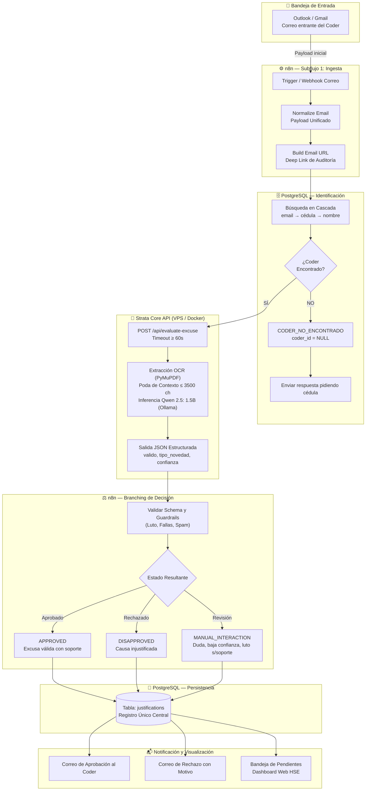

---

# 2. Contrato que entra a n8n

El adaptador de Outlook o Gmail entrega a n8n una estructura homogénea para desacoplar el origen del mensaje:

```json
{
  "source_provider": "OUTLOOK",
  "message_id": "AAMkAGI2...",
  "conversation_id": "AAQkAGI...",
  "sender_email": "coder@example.com",
  "sender_name": "Laura Gómez",
  "email_subject": "Justificación inasistencia 25 Septiembre",
  "email_body": "Buenos días, adjunto comprobante médico...",
  "received_at": "2026-09-25T14:10:00Z",
  "attachments": [
    {
      "filename": "incapacidad_eps.pdf",
      "mime_type": "application/pdf",
      "data_base64": "JVBERi0xLjQK..."
    }
  ]
}
```

**Responsabilidad de n8n:** Conservar este payload intacto, evitar la pérdida de los adjuntos o del cuerpo crudo y enriquecer el objeto con los metadatos necesarios para trazabilidad y auditoría.

---

# 3. Estructura completa de n8n

La implementación se estructura en **tres subflujos lógicos interconectados**:

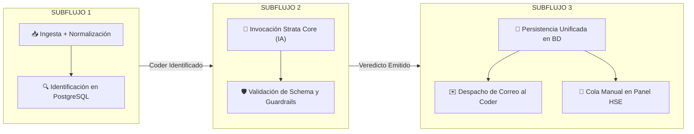

Esta división modular conserva la separación funcional recomendada en el repositorio, pero integra directamente **Strata Core / Qwen 2.5** y el esquema definitivo de PostgreSQL.

---

# 4. SUBFLUJO 1 — Ingesta y normalización

## Diagrama n8n del Subflujo 1

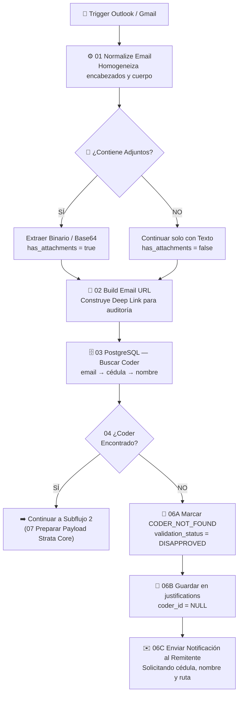

## Nodo 1 — Trigger de correo
* **Función:** Iniciar la ejecución ante un nuevo mensaje en la bandeja de entrada (Webhook de Outlook Graph API, Gmail Push Notifications o sondeo IMAP).
* **Entrada esperada:** Payload del proveedor de correo.
* **Metadatos esenciales:** `message_id`, `conversation_id`, `sender_email`, `sender_name`, `email_subject`, `email_body`, `received_at` y `attachments`.

## Nodo 2 — Normalize Email
Estandariza los nombres de propiedades para que el resto del workflow sea agnóstico respecto a la plataforma de correo:

| Entrada Outlook / Gmail | Propiedad Unificada n8n | Tipo |
| :--- | :--- | :--- |
| `id` / `messageId` | `message_id` | String |
| `conversationId` / `threadId` | `conversation_id` | String |
| `from.emailAddress.address` / `from` | `sender_email` | String (Lowercase) |
| `from.emailAddress.name` | `sender_name` | String |
| `subject` | `email_subject` | String |
| `body.content` / `snippet` | `email_body` | String |
| `receivedDateTime` / `date` | `received_at` | TIMESTAMPTZ (ISO) |
| `attachments[]` | `attachments[]` | Array de Objetos |

## Nodo 3 — Extract Attachments
Produce la lista de adjuntos con sus metadatos y una bandera booleana operativa:
* `has_attachments = true | false`
* `filename`, `mime_type`, `size_bytes`, `data_base64`.

> [!NOTE]
> **No debe asumirse que todos los correos tienen adjunto.** Strata Core admite la evaluación de correos de texto plano sin archivos anexos.

## Nodo 4 — Build Email URL
Construye automáticamente el hipervínculo directo al correo para el panel web de HSE:
* **Outlook Web:** `https://outlook.office.com/mail/deeplink/read/${encodeURIComponent(message_id)}`
* **Gmail:** `https://mail.google.com/mail/u/0/#search/rfc822msgid%3A${encodeURIComponent(message_id)}`

## Nodo 5 — PostgreSQL: Búsqueda del Coder
La identificación se ejecuta obligatoriamente antes de evaluar la excusa, siguiendo una estrategia de búsqueda en cascada:

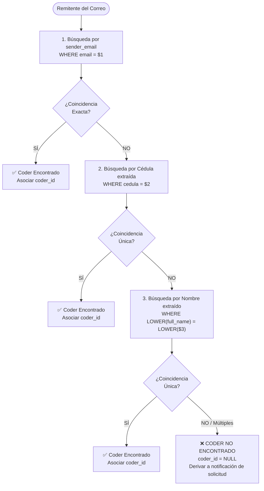

## Nodo 6 — IF `coder_found`
* **Rama TRUE:** Avanza hacia la evaluación de inteligencia artificial en Strata Core.
* **Rama FALSE:** El sistema no inventa identidad. Se persiste el correo en `justifications` con `coder_id = NULL`, `coder_identification_status = 'CODER_NOT_FOUND'`, `validation_status = 'DISAPPROVED'` y se dispara una respuesta automática al remitente solicitando su cédula y nombre completo.

---

# 5. SUBFLUJO 2 — Evaluación con Strata Core

## Vista del Branch de IA

```mermaid
flowchart TD
    A["07 Prepare Strata Payload<br/>email_subject, email_body, model, file_base64"] --> B["🌐 08 HTTP Request a Strata Core<br/>POST /api/evaluate-excuse (Timeout 60s)"]
    B --> C{"09 ¿Error Técnico<br/>o Timeout?"}
    
    C -->|SÍ (Caída Ollama / Error HTTP)| FAIL["⚠️ Failover de Resiliencia<br/>valido = false, requiere_manual = true<br/>ai_confidence = 0.0"]
    C -->|NO (Respuesta 200 OK)| PARSE["Parsear JSON de IA<br/>valido, tipo, fecha, motivo, score"]
    
    FAIL --> G["🛡️ Guardrails Deterministas<br/>Verificar Luto, Spam, etc."]
    PARSE --> G
    
    G --> D{"10 Decision Switch<br/>validation_status"}
    
    D -->|APPROVED| BRANCH_A["✅ Branch A: Aprobado<br/>valido=true AND manual=false AND score>=0.80"]
    D -->|DISAPPROVED| BRANCH_B["❌ Branch B: Rechazado<br/>valido=false AND manual=false"]
    D -->|MANUAL_INTERACTION| BRANCH_C["⚠️ Branch C: Manual HSE<br/>manual=true OR score<0.80 OR error"]
```

## Nodo 1 — Prepare Strata Payload
Prepara el cuerpo de la petición hacia la API local de Strata Core:

```json
{
  "email_subject": "Incapacidad médica 25 Septiembre",
  "email_body": "Buenos días, adjunto comprobante médico de EPS Sanitas...",
  "model": "qwen2.5:1.5b",
  "file_base64": "JVBERi0xLjQK...",
  "filename": "incapacidad_eps.pdf"
}
```

## Nodo 2 — HTTP Request a Strata Core
* **Endpoint:** `POST http://localhost:8001/api/evaluate-excuse`
* **Timeout configurado:** `60000 ms` (60 segundos).
* **Parámetro clave:** `continueOnFail: true` para habilitar el failover automático ante saturación del modelo.

## Pipeline Interno de Strata Core

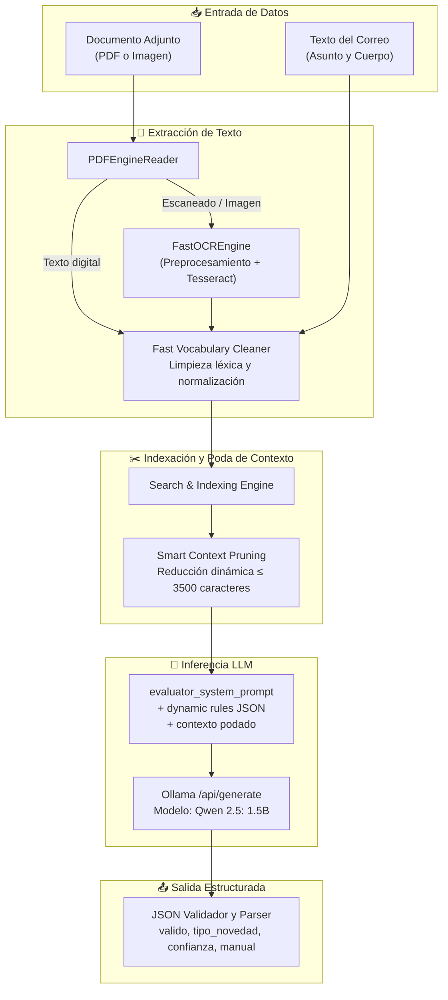

---

# 6. Qué hace Qwen y qué NO hace

### Responsabilidad de Qwen 2.5: 1.5B
* Razona sobre el contexto podado suministrado por Strata Core.
* Produce la salida JSON estructurada con:
  * `valido`: Boolean
  * `tipo_novedad`: Categoría detectada
  * `fecha_afectada`: Fecha extraída
  * `motivo_decision`: Síntesis en lenguaje natural
  * `confianza_score`: Nivel de certidumbre (0.00 a 1.00)
  * `requiere_revision_manual`: Bandera de ambigüedad
  * `detalles_adjunto`: Datos del documento analizado

### Responsabilidad de Strata Core (previo a Qwen)
* Extracción binaria, OCR de imágenes/PDFs, limpieza léxica, detección de firmas/sellos y poda del prompt para no saturar la ventana de contexto.

### Responsabilidad de n8n
* Orquestar la comunicación, identificar al coder en PostgreSQL, aplicar guardrails deterministas, resolver el enrutamiento y ejecutar la persistencia en base de datos.

---

# 7. Respuesta de Strata Core y Branch Principal de Decisión

### Contrato JSON devuelto por Strata Core:

```json
{
  "valido": true,
  "tipo_novedad": "inasistencia_medica",
  "fecha_afectada": "2026-09-25",
  "motivo_decision": "Documento médico oficial válido con fecha y soporte verificable de EPS Sanitas.",
  "confianza_score": 0.95,
  "requiere_revision_manual": false,
  "detalles_adjunto": {
    "es_legible": true,
    "tiene_firma_o_sello": true,
    "institucion_emisora": "EPS Sanitas",
    "paginas_consultadas": [1]
  },
  "tiempo_procesamiento_segundos": 10.65
}
```

## Lógica de Enrutamiento del Decision Switch

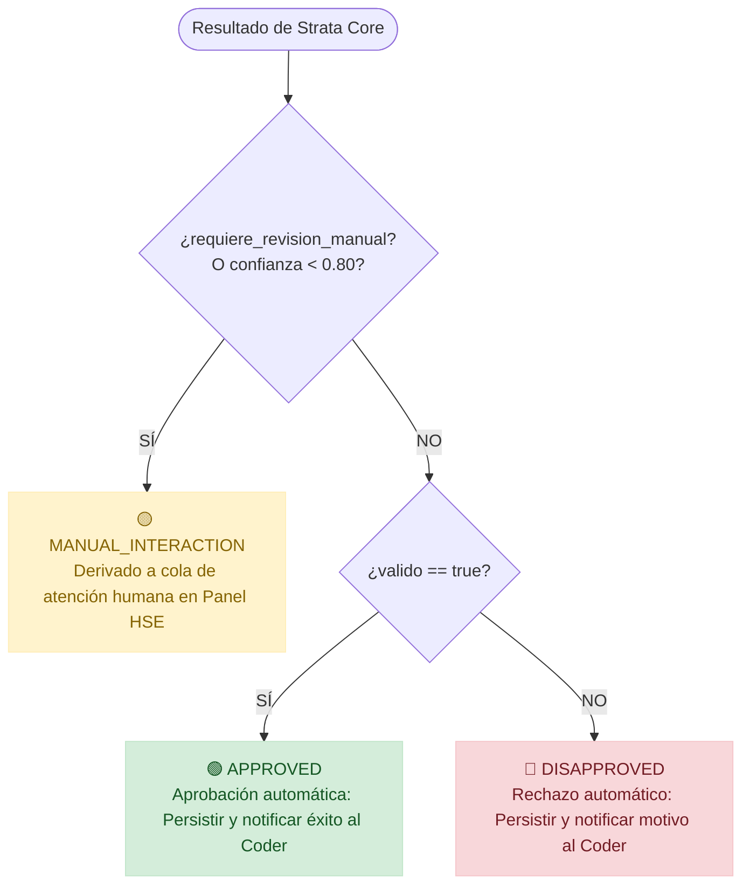

* **Branch A (APPROVED):** `valido === true` AND `requiere_revision_manual === false` AND `confianza_score >= 0.80`. Guarda en `justifications` y despacha correo de confirmación al coder.
* **Branch B (REJECTED):** `valido === false` AND `requiere_revision_manual === false`. Guarda en `justifications` con el motivo del rechazo y despacha correo informativo.
* **Branch C (MANUAL_INTERACTION):** `requiere_revision_manual === true` OR `confianza_score < 0.80`. Guarda en `justifications` y expone el caso en la bandeja de pendientes del Dashboard HSE.

---

# 8. Failover y Resiliencia cuando Ollama falla

El microservicio Strata Core y el workflow de n8n implementan una contingencia activa para evitar que caídas de infraestructura rechacen injustamente la excusa de un estudiante:

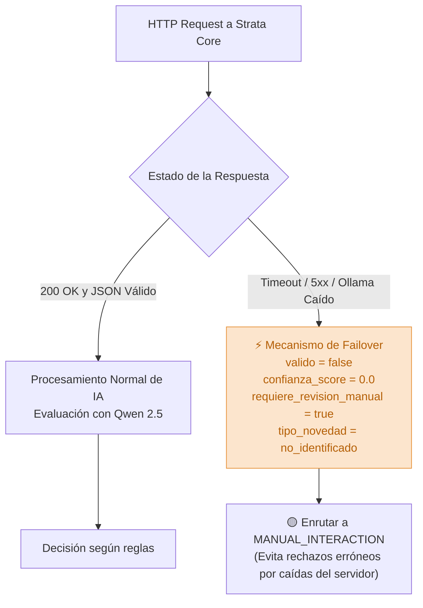

---

# 9. Guardrails Deterministas de Negocio

Antes de tomar la decisión definitiva, el nodo `09 Validar Schema y Guardrails` en n8n inspecciona el texto del mensaje para aplicar reglas deterministas:

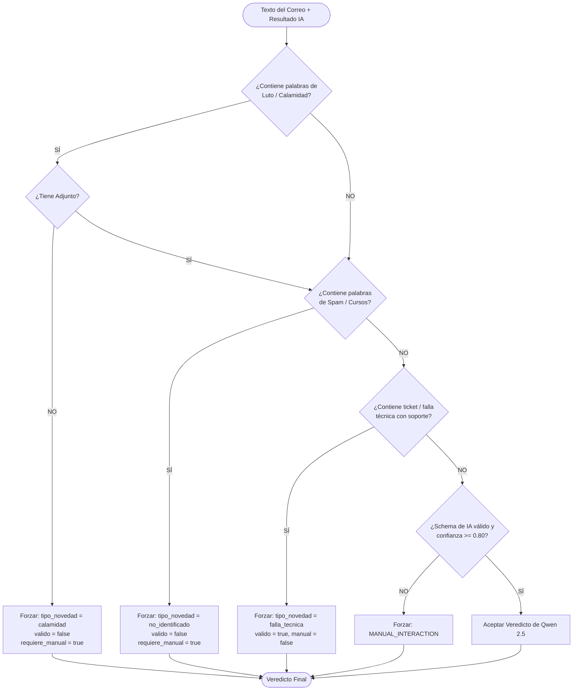

1. **Calamidad Familiar / Luto:** Términos como *fallecimiento*, *luto*, *funeraria*, *entierro*. Si no hay archivo adjunto, se fuerza `valido = false` y `requiere_revision_manual = true` para que HSE brinde acompañamiento humano sensible.
2. **Spam / Publicidad:** Términos como *descuento*, *cursos de*, *promoción*. Se clasifican como `no_identificado` y se derivan a revisión manual.
3. **Fallas Técnicas:** Términos como *ticket*, *fibra*, *Claro*, *Tigo*, *sin internet*. Con soporte se aprueban; sin soporte se derivan a revisión.

---

# 10. Persistencia en PostgreSQL

El sistema utiliza el **modelo simplificado de 3 entidades maestras**, manteniendo un único registro histórico inmutable para cada correo procesado:

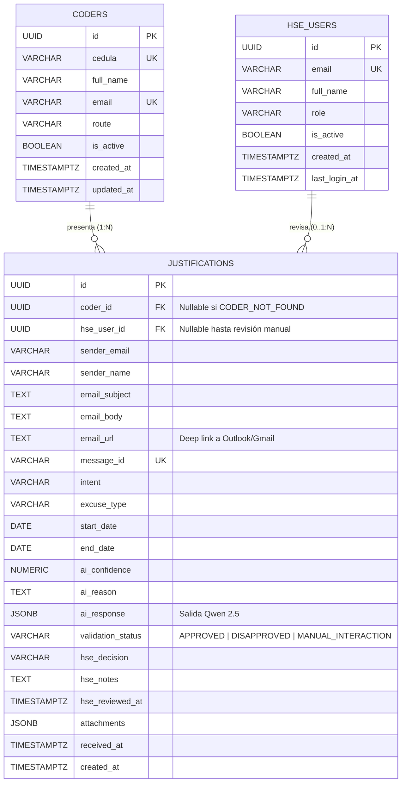

**Beneficio Operativo:** Los registros permanecen en la misma tabla `justifications` y nunca se mueven de lugar. El frontend consume la vista enriquecida `v_justifications_dashboard` y filtra por `validation_status` en tiempo real.

---

# 11. SUBFLUJO 3 — Intervención manual HSE y Despacho

## Intervención Manual desde el Panel HSE

Cuando una justificación queda en estado `MANUAL_INTERACTION`, el personal de HSE puede auditar el caso y resolverlo mediante el webhook dedicado:

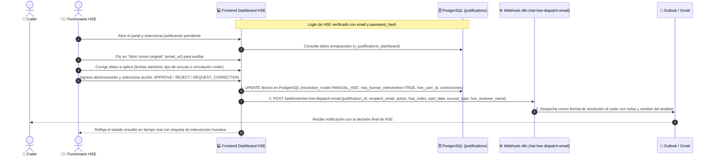

## Despacho Automatizado de Correos

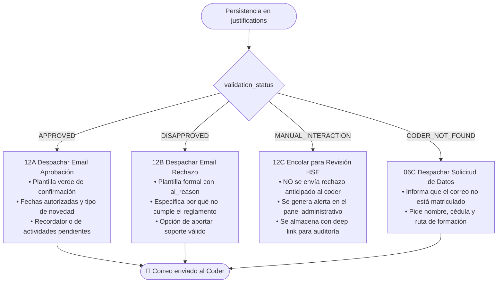

---

# 12. Gestión de Errores Técnicos y Resiliencia

El flujo distingue estrictamente entre un **fallo de validación de negocio** y un **fallo técnico de infraestructura**:

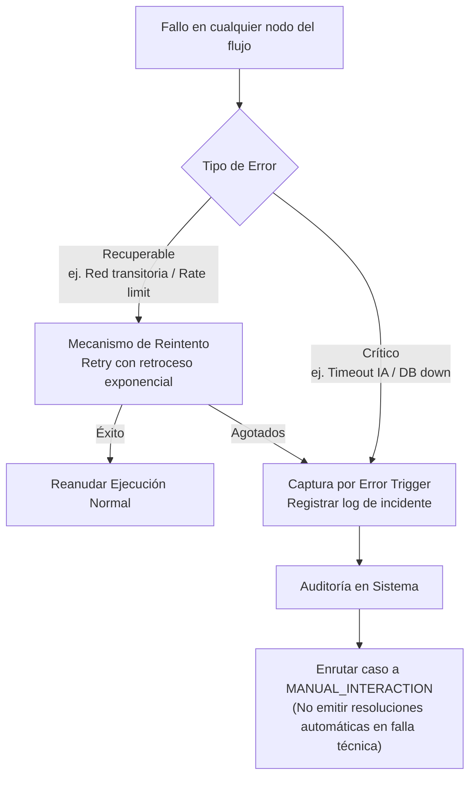

---

# 13. Flujo Completo Consolidado

A continuación se presenta el mapa completo de nodos implementados en [`n8n_workflow_email_hse.json`](file:///home/wuisino/Projects/Email-Riwi/n8n_workflow_email_hse.json):

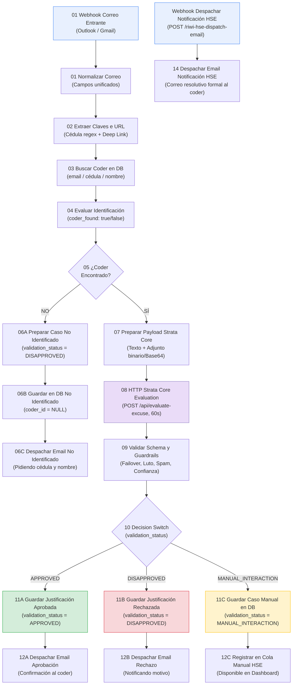

---

# 14. Inventario de Nodos del Workflow n8n

| # | Nombre del Nodo | Tipo de Nodo n8n | Responsabilidad Funcional |
| :---: | :--- | :--- | :--- |
| **00** | Webhook Correo Entrante | `n8n-nodes-base.webhook` | Recibir payload de Outlook o Gmail vía Webhook |
| **01** | 01 Normalizar Correo | `n8n-nodes-base.code` | Homogeneizar estructura del mensaje y procesar adjuntos |
| **02** | 02 Extraer Claves e URL | `n8n-nodes-base.code` | Generar `email_url` y extraer posible cédula con regex |
| **03** | 03 Buscar Coder en DB | `n8n-nodes-base.postgres` | Consulta SQL en cascada en la tabla `coders` |
| **04** | 04 Evaluar Identificación | `n8n-nodes-base.code` | Determinar `coder_found` (true/false) y fusionar datos |
| **05** | 05 Coder Encontrado? | `n8n-nodes-base.if` | Bifurcación: continuar evaluación o solicitar datos |
| **06A**| 06A Preparar Caso No Identificado | `n8n-nodes-base.code` | Configurar caso CODER_NOT_FOUND y plantilla HTML |
| **06B**| 06B Guardar en DB No Identificado | `n8n-nodes-base.postgres` | INSERT en `justifications` con `coder_id = NULL` |
| **06C**| 06C Despachar Email No Identificado | `n8n-nodes-base.code` | Enviar correo al remitente solicitando identificación |
| **07** | 07 Preparar Payload Strata Core | `n8n-nodes-base.code` | Empaquetar texto y adjunto Base64 para el motor de IA |
| **08** | 08 HTTP Strata Core Evaluation | `n8n-nodes-base.httpRequest`| POST a `/api/evaluate-excuse` con timeout de 60s |
| **09** | 09 Validar Schema y Guardrails | `n8n-nodes-base.code` | Failover, guardrails deterministas y umbral de score |
| **10** | 10 Decision Switch | `n8n-nodes-base.switch` | Enrutar a APPROVED, DISAPPROVED o MANUAL |
| **11A**| 11A Guardar Justificación Aprobada | `n8n-nodes-base.postgres` | INSERT con `validation_status = 'APPROVED'` |
| **12A**| 12A Despachar Email Aprobación | `n8n-nodes-base.code` | Despachar confirmación positiva al coder |
| **11B**| 11B Guardar Justificación Rechazada | `n8n-nodes-base.postgres` | INSERT con `validation_status = 'DISAPPROVED'` |
| **12B**| 12B Despachar Email Rechazo | `n8n-nodes-base.code` | Despachar notificación de rechazo con motivo |
| **11C**| 11C Guardar Caso Manual en DB | `n8n-nodes-base.postgres` | INSERT con `validation_status = 'MANUAL_INTERACTION'` |
| **12C**| 12C Registrar en Cola Manual HSE | `n8n-nodes-base.code` | Notificar disponibilidad en Dashboard HSE |
| **13** | Webhook Despachar Notificación HSE | `n8n-nodes-base.webhook` | Endpoint de despacho de correo disparado por Frontend tras UPDATE directo |
| **14** | 14 Despachar Email Notificación HSE | `n8n-nodes-base.code` | Construir y enviar correo resolutivo formal al coder con notas del analista |

---

# 15. Secuencia Temporal de una Ejecución Completa

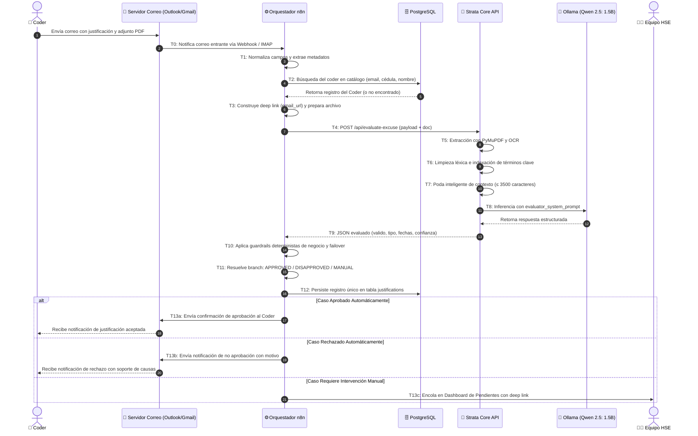

---

# 16. Casos de Prueba y Validación Automatizada

La suite automatizada implementada en [`test_workflow_simulation.py`](file:///home/wuisino/Projects/Email-Riwi/test_workflow_simulation.py) valida el comportamiento del sistema ante los siguientes 6 escenarios operativos:

1. **Coder Identificado + Incapacidad Médica Válida:** Coder con correo institucional adjunta certificado EPS Sanitas $\longrightarrow$ `APPROVED`.
2. **Coder No Encontrado:** Remitente envía correo desde buzón externo sin cédula $\longrightarrow$ `CODER_NOT_FOUND` y solicitud de datos.
3. **Calamidad Familiar sin Adjunto:** Coder reporta fallecimiento de familiar sin certificado $\longrightarrow$ Guardrail intercepta y deriva a `MANUAL_INTERACTION`.
4. **Failover Técnico por Caída de Ollama:** Servidor de IA no responde $\longrightarrow$ Contingencia activa `MANUAL_INTERACTION` con confianza 0.0 sin emitir rechazos erróneos.
5. **Causa Injustificada:** Coder explica que no asistió por quedarse dormido $\longrightarrow$ `DISAPPROVED` con notificación explicativa.
6. **Resolución Manual por Webhook HSE:** Analista de bienestar aprueba caso excepcional en el panel web $\longrightarrow$ Actualización en BD y notificación resolutiva.

---

# 17. Resumen Operacional

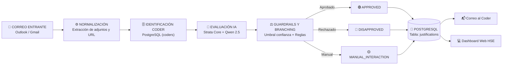

La clave fundamental de esta arquitectura es que **n8n no realiza OCR ni inferencia pesada**: los consume como un servicio HTTP especializado en Strata Core. Del mismo modo, Strata Core no administra identidades de coders ni estados relacionales; n8n y PostgreSQL se encargan de toda la orquestación, auditoría y trazabilidad.
